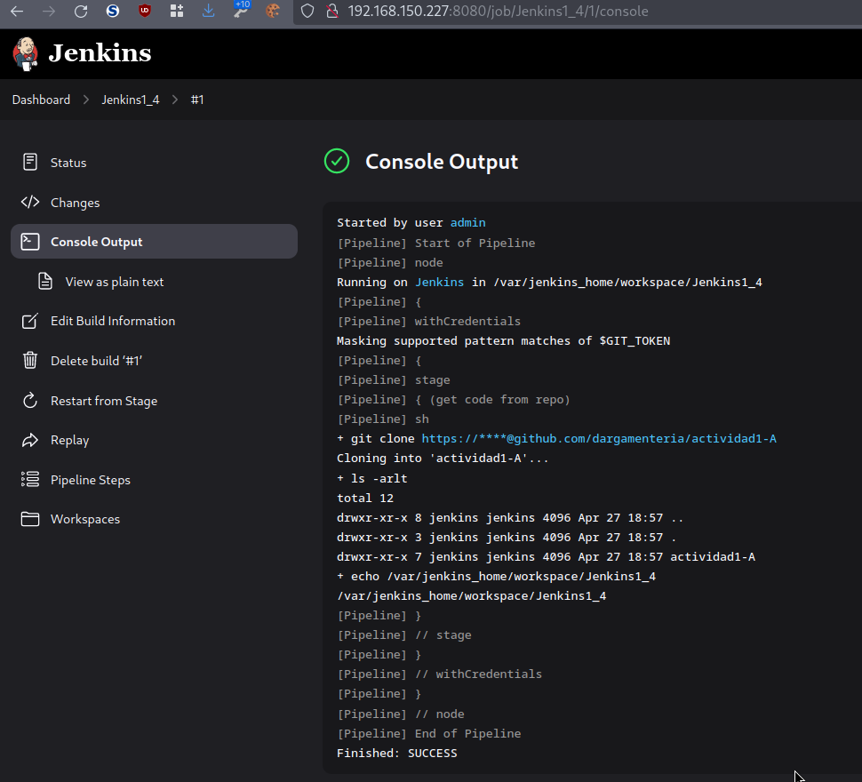
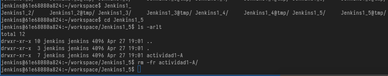

-   [Reto1](#reto1)
    -   [Clonado del proyecto con
        Github](#clonado-del-proyecto-con-github)
    -   [Securización local del repositorio
        git](#securización-local-del-repositorio-git)
    -   [Pruebas de integración con flask y
        wiremock](#pruebas-de-integración-con-flask-y-wiremock)
        -   [Unit test con
            pytest](#unit-test-con-pytest)
        -   [Pruebas con flask y
            wiremock](#pruebas-con-flask-y-wiremock)
    -   [Jenkins](#jenkins)
        -   [Arquitectura](#arquitectura)
        -   [Instalación](#instalación)
            -   [Pruebas de
                conectividad](#pruebas-de-conectividad)
        -   [Prueba 1](#prueba-1)
            -   [Crear y ejecutar un pipeline simple, una sola etapa con
                un
                "echo"](#crear-y-ejecutar-un-pipeline-simple-una-sola-etapa-con-un-echo)
            -   [Añadir un comando git para traer todo el código fuente
                del
                repositorio](#añadir-un-comando-git-para-traer-todo-el-código-fuente-del-repositorio)
            -   [Verificar que el código se ha descargado mediante
                comando dir (o ls
                --la)](#verificar-que-el-código-se-ha-descargado-mediante-comando-dir-o-ls-la)
            -   [Verificar cuál es el espacio de trabajo (echo
                %WORKSPACE% o echo
                \$WORKSPACE)](#verificar-cuál-es-el-espacio-de-trabajo-echo-workspace-o-echo-workspace)
            -   [Añadir etapa "Build" (que no hace nada
                realmente)](#añadir-etapa-build-que-no-hace-nada-realmente)
        -   [Prueba 2](#prueba-2)
            -   [Añadir etapa Unit lanzando solo las pruebas
                unitarias](#añadir-etapa-unit-lanzando-solo-las-pruebas-unitarias)
            -   [Añadir etapa Service (secuencial) lanzado las pruebas
                de
                servicio](#añadir-etapa-service-secuencial-lanzado-las-pruebas-de-servicio)
            -   [Convertir ambas etapas para se ejecuten en
                paralelo](#convertir-ambas-etapas-para-se-ejecuten-en-paralelo)
            -   [Añadir una etapa posterior para conectar con
                JUnit](#añadir-una-etapa-posterior-para-conectar-con-junit)
        -   [Prueba 3](#prueba-3)
            -   [Crear un pipeline donde se use un Jenkinsfile de
                vuestro repositorio en
                GitHub](#crear-un-pipeline-donde-se-use-un-jenkinsfile-de-vuestro-repositorio-en-github)
                -   [Activar polling en Jenkins para que se ejecute el
                    pipeline cuando haya
                    cambios](#activar-polling-en-jenkins-para-que-se-ejecute-el-pipeline-cuando-haya-cambios)
                -   [Hacer cualquier cambio en el código y verificar que
                    se ejecuta el
                    pipeline](#hacer-cualquier-cambio-en-el-código-y-verificar-que-se-ejecuta-el-pipeline)

# Reto1

## Clonado del proyecto con Github

Se puede realizar de 2 formas una directamente es desde la propia
interfaz de github. Este nos permite clonar un repositorio. Como se
muestra en las siguientes imágenes.

\


También se puede realizar via shell

1.  Se clona el repositorio objetivo

``` bash
$ git clone https://github.com/anieto-unir/helloworld.git
Cloning into 'helloworld'...
remote: Enumerating objects: 365, done.
remote: Counting objects: 100% (155/155), done.
remote: Compressing objects: 100% (57/57), done.
remote: Total 365 (delta 134), reused 98 (delta 98), pack-reused 210
Receiving objects: 100% (365/365), 82.10 KiB | 1.19 MiB/s, done.
Resolving deltas: 100% (163/163), done
```

2.  Se listan los remote

``` bash
$ git remote -v
origin  https://github.com/anieto-unir/helloworld.git (fetch)
origin  https://github.com/anieto-unir/helloworld.git (push)
```

3.  Los eliminamos y añadimos los del repositorio objetivo

```{=html}
<!-- -->
```
    $ git remote  remove origin
    $ git remote -v

## Securización local del repositorio git

1.  Para que no ande preguntando por las credenciales usamos
    [pass](https://www.passwordstore.org/) para almacenarlas utilizando
    [pass-git-helper](https://github.com/languitar/pass-git-helper) para
    la integración

``` bash
File: /home/dani/.gitconfig
[user]
    name = dargamenteria
    email = dargamenteria@paranoidworld.es
[credential "https://github.com/dargamenteria/"]
  username=dargamenteria@paranoidworld.es
  useHttpPath = true
  helper = pass -p "github/{path}" --template "~/.config/git-credential-pass/github.dargamenteria.template"
```

2.  Añadimos el nuevo origen el token lo sacamos directamente de pass

``` bash
$ git remote add origin  https://github.com/dargamenteria/actividad1-A.git
$ git remote -v
origin  https://github.com/dargamenteria/actividad1-A.git (fetch)
origin  https://github.com/dargamenteria/actividad1-A.git (push)

$ pass
Password Store
├── admin
│   └── keepass.gpg
├── github
│   ├── dargamenteria
│   │   └── actividad1-A.git.gpg
│   └── token.gpg
```

3.  Subimos los cambio\
    

``` bash
git push origin master
Enumerating objects: 8, done.
Counting objects: 100% (8/8), done.
Delta compression using up to 8 threads
Compressing objects: 100% (7/7), done.
Writing objects: 100% (7/7), 158.96 KiB | 19.87 MiB/s, done.
Total 7 (delta 1), reused 0 (delta 0), pack-reused 0 (from 0)
remote: Resolving deltas: 100% (1/1), completed with 1 local object.
To https://github.com/dargamenteria/actividad1-A.git
   935b003..0a464b8  master -> master
```

4.  En este punto tenemos el repositorio conectado y las credenciales
    securizadas en un repositorio, local, de claves.

## Pruebas de integración con flask y wiremock

### Unit test con pytest

Primero de todo hacemos las pruebas unitarias con pytest

1.  Cargamos las variables de entorno

``` bash
ubuntu@docker:~/unir/cp1a/actividad1-A$ export PYTHONPATH=.
```

2.  Ejecutamos las pruebas unitarias

``` bash
ubuntu@docker:~/unir/cp1a/actividad1-A$ pytest-3 $(pwd)/test/unit
===================================================================== test session starts =====================================================================
platform linux -- Python 3.10.12, pytest-6.2.5, py-1.10.0, pluggy-0.13.0
rootdir: /home/ubuntu/unir/cp1a/actividad1-A, configfile: pytest.ini
collected 11 items

test/unit/calc_test.py .........                                                                                                                        [ 81%]
test/unit/util_test.py ..                                                                                                                               [100%]

===================================================================== 11 passed in 0.03s ======================================================================
```

3.Forzamos un error para verificar el correcto funcionamiento de las
pruebas

``` python
ubuntu@docker:~/unir/cp1a/actividad1-A$ grep -C3 5 test/unit/calc_test.py
        self.calc = Calculator()

    def test_add_method_returns_correct_result(self):
        self.assertEqual(5, self.calc.add(2, 2))
        self.assertEqual(0, self.calc.add(2, -2))
        self.assertEqual(0, self.calc.add(-2, 2))
        self.assertEqual(1, self.calc.add(1, 0))
--

    def test_divide_method_returns_correct_result(self):
        self.assertEqual(1, self.calc.divide(2, 2))
        self.assertEqual(1.5, self.calc.divide(3, 2))
        self.assertRaises(TypeError, self.calc.divide, "2", 2)

    def test_add_method_fails_with_nan_parameter(self):
--

    def test_substract_method_returns_correct_result(self):
        self.assertEqual(4, self.calc.substract(10, 6))
        self.assertEqual(-2, self.calc.substract(256, 258))
        self.assertEqual(-1, self.calc.substract(-1, 0))
        self.assertEqual(0, self.calc.substract(0, 0))
        self.assertEqual(0, self.calc.substract(0, 0))
ubuntu@docker:~/unir/cp1a/actividad1-A$ pytest-3 $(pwd)/test/unit
===================================================================== test session starts =====================================================================
platform linux -- Python 3.10.12, pytest-6.2.5, py-1.10.0, pluggy-0.13.0
rootdir: /home/ubuntu/unir/cp1a/actividad1-A, configfile: pytest.ini
collected 11 items

test/unit/calc_test.py .F.......                                                                                                                        [ 81%]
test/unit/util_test.py ..                                                                                                                               [100%]

========================================================================== FAILURES ===========================================================================
____________________________________________________ TestCalculate.test_add_method_returns_correct_result _____________________________________________________

self = <unit.calc_test.TestCalculate testMethod=test_add_method_returns_correct_result>

    def test_add_method_returns_correct_result(self):
>       self.assertEqual(5, self.calc.add(2, 2))
E       AssertionError: 5 != 4

test/unit/calc_test.py:13: AssertionError
=================================================================== short test summary info ===================================================================
FAILED test/unit/calc_test.py::TestCalculate::test_add_method_returns_correct_result - AssertionError: 5 != 4
================================================================ 1 failed, 10 passed in 0.10s =================================================================
```

4.  Revertimos el cambio


### Pruebas con flask y wiremock

1.  Cargamos las variables de entorno

``` bash
ubuntu@docker:~/unir/cp1a/actividad1-A$ export PYTHONPATH=$(pwd)
ubuntu@docker:~/unir/cp1a/actividad1-A$ export FLASK_APP=$(pwd)/app/api.py
ubuntu@docker:~/unir/cp1a/actividad1-A$ echo $PYTHONPATH
/home/ubuntu/unir/cp1a/actividad1-A
ubuntu@docker:~/unir/cp1a/actividad1-A$ echo $FLASK_APP
/home/ubuntu/unir/cp1a/actividad1-A/app/api.py
```

2.  Arrancamos flask. Dado que lo ejecutamos en un servidor remoto hemos
    de hacer que las pruebas se lanzen en el interfaz de red correcto

``` bash
ubuntu@docker:~/unir/cp1a/actividad1-A$ flask run --host 0.0.0.0
 * Serving Flask app '/home/ubuntu/unir/cp1a/actividad1-A/app/api.py' (lazy loading)
 * Environment: production
   WARNING: This is a development server. Do not use it in a production deployment.
   Use a production WSGI server instead.
 * Debug mode: off
 * Running on all addresses.
   WARNING: This is a development server. Do not use it in a production deployment.
 * Running on http://192.168.150.227:5000/ (Press CTRL+C to quit)
192.168.150.250 - - [27/Apr/2024 02:16:00] "GET / HTTP/1.1" 200 -
192.168.150.250 - - [27/Apr/2024 02:16:01] "GET /favicon.ico HTTP/1.1" 404 -
```

\
\


Al ejecutar las pruebas observamos que fallan al no estar implementas
las funcionalidades de los test

3.  Levantamos wiremock\
    \
    Realizamos las pruebas con los microservicos

``` bash
ubuntu@docker:~/unir/cp1a/actividad1-A$  curl  -v http://192.168.150.227:9090/calc/sqrt/64 && echo
*   Trying 192.168.150.227:9090...
* Connected to 192.168.150.227 (192.168.150.227) port 9090 (#0)
> GET /calc/sqrt/64 HTTP/1.1
> Host: 192.168.150.227:9090
> User-Agent: curl/7.81.0
> Accept: */*
>
* Mark bundle as not supporting multiuse
< HTTP/1.1 200 OK
< Content-Type: text/plain
< Access-Control-Allow-Origin: *
< Matched-Stub-Id: ae426a77-bb26-4e35-8df4-1c1758df0bb0
< Transfer-Encoding: chunked
<
* Connection #0 to host 192.168.150.227 left intact
8
ubuntu@docker:~/unir/cp1a/actividad1-A$ curl -vvv localhost:9090/calc/sqrt/65
*   Trying 127.0.0.1:9090...
* Connected to localhost (127.0.0.1) port 9090 (#0)
> GET /calc/sqrt/65 HTTP/1.1
> Host: localhost:9090
> User-Agent: curl/7.81.0
> Accept: */*
>
* Mark bundle as not supporting multiuse
< HTTP/1.1 404 Not Found
< Content-Type: text/plain;charset=UTF-8
< Transfer-Encoding: chunked
<

                                               Request was not matched
                                               =======================

-----------------------------------------------------------------------------------------------------------------------
| Closest stub                                             | Request                                                  |
-----------------------------------------------------------------------------------------------------------------------
                                                           |
GET                                                        | GET
/calc/sqrt/64                                              | /calc/sqrt/65                                       <<<<< URL does not match
                                                           |
                                                           |
-----------------------------------------------------------------------------------------------------------------------
* Connection #0 to host localhost left intact
```

Volvemos a ejecutar los test de los microservicios y observamos que
funcionan


## Jenkins

### Arquitectura

Para la ejecución de las pruebas de Jenkins, utilizamos:

-   Contenedor docker de jenkins en el nodo kvm 192.168.150.227
-   Esclavos en los nodos kvm
    -   slave1: 192.168.150.205
    -   slave2: 192.168.150.229

### Instalación

Para la creación de los slaves utilizamos el script de terraform
incluido en la carpeta iac

``` go
terraform init

Initializing the backend...

Initializing provider plugins...
- Reusing previous version of dmacvicar/libvirt from the dependency lock file
- Finding latest version of hashicorp/null...
- Reusing previous version of hashicorp/template from the dependency lock file
- Using previously-installed dmacvicar/libvirt v0.7.6
- Installing hashicorp/null v3.2.2...
- Installed hashicorp/null v3.2.2 (signed by HashiCorp)
- Using previously-installed hashicorp/template v2.2.0
```

``` go
+[dani@draco ~/Documents/asignaturas/unir/devops/actividades/act1/iac ](TF:default) $ terraform apply
data.template_file.user_data: Reading...
data.template_file.network_config: Reading...
data.template_file.network_config: Read complete after 0s [id=b36a1372ce4ea68b514354202c26c0365df9a17f25cd5acdeeaea525cd913edc]
data.template_file.user_data: Read complete after 0s [id=275470003dc1462910bba6474796415d5468ae414ae3b0b70498f39bb908bca4]

Terraform used the selected providers to generate the following execution plan. Resource actions are indicated with the following symbols:
  + create

Terraform will perform the following actions:

  # libvirt_cloudinit_disk.commoninit will be created
  + resource "libvirt_cloudinit_disk" "commoninit" {
      + id             = (known after apply)
      + name           = "commoninit.iso"
      + network_config = <<-EOT
            version: 2
            ethernets:
              ens3:
                dhcp4: true
        EOT
      + pool           = "pools"
      + user_data      = <<-EOT
            #cloud-config
            # vim: syntax=yaml
            # examples:
            # https://cloudinit.readthedocs.io/en/latest/topics/examples.html
            bootcmd:
              - echo "BOOT CMD"
            runcmd:
             - [ ls, -l, / ]
             - [ sh, -xc, "echo $(date) ': hello world!'" ]
            ssh_pwauth: true
            disable_root: false
            chpasswd:
              list: |
                 root:temporal
                 ubuntu:temporal
              expire: false
            users:
              - name: ubuntu
                sudo: ALL=(ALL) NOPASSWD:ALL
                groups: users, admin
                home: /home/ubuntu
                shell: /bin/bash
                lock_passwd: false
                ssh-authorized-keys:
                  - ssh-rsa AAAAB3NzaC1yc2EAAAADAQABAAABAQDj/qvzCFBoF7piKZzY7faURI4IeZowQGWhIzIkruxqmYz2CQOxjrr02dNM68ndJb/0nHv0aVApUzSsVPCjpq9FcVhysjtmKnPedDLpsQL2gCKoJJmlGAVNt/xLsV57dxma1/5Vf3oLjgKavQUG/PDho2z62/hg0U+MUoegcjG7STKVuidOWGE3mNsKIksWs1wI6y20ONO4ueO1pKWBBSZbCxK/lRo+gf6jiEVqmwxvOSv453H4ta4PN7iRpInwDQU1Dxz
+tCewPLID8d5Ewgao4a9oL04H0io8ESSSnnxyVaNbbG/pEOhN1MER81e2IS2MVXu7bodPIAPIjOMUrN8/ dani@draco
              - name: jenkins
                sudo: ALL=(ALL) NOPASSWD:ALL
                groups: users, admin
                home: /home/jenkins
                shell: /bin/bash
                lock_passwd: false
                ssh-authorized-keys:
                  - ssh-rsa AAAAB3NzaC1yc2EAAAADAQABAAABAQDj/qvzCFBoF7piKZzY7faURI4IeZowQGWhIzIkruxqmYz2CQOxjrr02dNM68ndJb/0nHv0aVApUzSsVPCjpq9FcVhysjtmKnPedDLpsQL2gCKoJJmlGAVNt/xLsV57dxma1/5Vf3oLjgKavQUG/PDho2z62/hg0U+MUoegcjG7STKVuidOWGE3mNsKIksWs1wI6y20ONO4ueO1pKWBBSZbCxK/lRo+gf6jiEVqmwxvOSv453H4ta4PN7iRpInwDQU1Dxz
+tCewPLID8d5Ewgao4a9oL04H0io8ESSSnnxyVaNbbG/pEOhN1MER81e2IS2MVXu7bodPIAPIjOMUrN8/ dani@draco
                  - ssh-rsa AAAAB3NzaC1yc2EAAAADAQABAAABgQChsNhpnJimKjQ2jjW8M591kuI3XlSHJpP1tTwzHoCqQU3twRUa2BljJOzg+2vzjsKOrKHqKNu3ycDAPPQVwO7XC8b8eyJSSVEA4b6zItYGDw11TRvJ0po3ZzHJp2wEkfrDebcQZlM1NqWM+vYorOY8g9Yx6LvX57RhvV5t8LY7vAERvoe0uq8hxtT4MhCwk2kod+iHGQSxEM9LgTpTX9EyVq+o6+Qnk5pvuUMkxThAXc+T4pvKlBniPk4yg7B9a+a7vAF
WxxLqxWCiIX9RlwhY/Moo8u24d7y2K7AKYsP3XWfvjvzSYoHWcvDF3uweKmxXm6m+mTyAHix/+ND/IcGN9iRpKlmEMnMVTE/MVc5XA8vWwBZysxaJaxgTbwrT7YlBt2/nKiFwe9YIexR3qEjk/5//iNvYJkLsIRfwBkiOZNpJPawjV2xC4wHwyORq3xToxgRyivPV906RsO7C7fuD0C8W8Bb6JpggLz3U8oM/WfN8WkCliukfkPvpKkNCa8E= jenkins@61e68080a824
            final_message: "The system is finally up, after $UPTIME seconds"
        EOT
    }

  # libvirt_domain.domain-kvm["slave1"] will be created
  + resource "libvirt_domain" "domain-kvm" {
      + arch        = (known after apply)
      + autostart   = (known after apply)
      + cloudinit   = (known after apply)
      + emulator    = (known after apply)
      + fw_cfg_name = "opt/com.coreos/config"
      + id          = (known after apply)
      + machine     = (known after apply)
      + memory      = 1024
      + name        = "slave1"
      + qemu_agent  = false
      + running     = true
      + type        = "kvm"
      + vcpu        = 1

      + console {
          + source_host    = "127.0.0.1"
          + source_service = "0"
          + target_port    = "0"
          + target_type    = "serial"
          + type           = "pty"
        }
      + console {
          + source_host    = "127.0.0.1"
          + source_service = "0"
          + target_port    = "1"
          + target_type    = "virtio"
          + type           = "pty"
        }

      + disk {
          + scsi      = false
          + volume_id = (known after apply)
        }

      + graphics {
          + autoport       = true
          + listen_address = "127.0.0.1"
          + listen_type    = "address"
          + type           = "spice"
        }

      + network_interface {
          + addresses      = (known after apply)
          + bridge         = "br0"
          + hostname       = "kvm_docker"
          + mac            = (known after apply)
          + network_id     = (known after apply)
          + network_name   = "default"
          + wait_for_lease = true
        }
    }

  # libvirt_domain.domain-kvm["slave2"] will be created
  + resource "libvirt_domain" "domain-kvm" {
      + arch        = (known after apply)
      + autostart   = (known after apply)
      + cloudinit   = (known after apply)
      + emulator    = (known after apply)
      + fw_cfg_name = "opt/com.coreos/config"
      + id          = (known after apply)
      + machine     = (known after apply)
      + memory      = 1024
      + name        = "slave2"
      + qemu_agent  = false
      + running     = true
      + type        = "kvm"
      + vcpu        = 1

      + console {
          + source_host    = "127.0.0.1"
          + source_service = "0"
          + target_port    = "0"
          + target_type    = "serial"
          + type           = "pty"
        }
      + console {
          + source_host    = "127.0.0.1"
          + source_service = "0"
          + target_port    = "1"
          + target_type    = "virtio"
          + type           = "pty"
        }

      + disk {
          + scsi      = false
          + volume_id = (known after apply)
        }

      + graphics {
          + autoport       = true
          + listen_address = "127.0.0.1"
          + listen_type    = "address"
          + type           = "spice"
        }

      + network_interface {
          + addresses      = (known after apply)
          + bridge         = "br0"
          + hostname       = "kvm_docker"
          + mac            = (known after apply)
          + network_id     = (known after apply)
          + network_name   = "default"
          + wait_for_lease = true
        }
    }

  # libvirt_volume.kvm_docker_vol["slave1"] will be created
  + resource "libvirt_volume" "kvm_docker_vol" {
      + format = "qcow2"
      + id     = (known after apply)
      + name   = "kvm_slave1-qcow2"
      + pool   = "pools"
      + size   = (known after apply)
      + source = "/files/vrt/libvirt/pools/ubuntu-22.04-server-cloudimg-amd64.img"
    }

  # libvirt_volume.kvm_docker_vol["slave2"] will be created
  + resource "libvirt_volume" "kvm_docker_vol" {
      + format = "qcow2"
      + id     = (known after apply)
      + name   = "kvm_slave2-qcow2"
      + pool   = "pools"
      + size   = (known after apply)
      + source = "/files/vrt/libvirt/pools/ubuntu-22.04-server-cloudimg-amd64.img"
    }

  # null_resource.provisioner["slave1"] will be created
  + resource "null_resource" "provisioner" {
      + id = (known after apply)
    }

  # null_resource.provisioner["slave2"] will be created
  + resource "null_resource" "provisioner" {
      + id = (known after apply)
    }

Plan: 7 to add, 0 to change, 0 to destroy.

Do you want to perform these actions?
  Terraform will perform the actions described above.
  Only 'yes' will be accepted to approve.

...
...

null_resource.provisioner["slave1"] (remote-exec): No VM guests are running outdated
null_resource.provisioner["slave1"] (remote-exec):  hypervisor (qemu) binaries on this
null_resource.provisioner["slave1"] (remote-exec):  host.
null_resource.provisioner["slave1"]: Creation complete after 1m43s [id=3813400819019273591]

Apply complete! Resources: 8 added, 0 changed, 0 destroyed.
+[dani@draco ~/Documents/asignaturas/unir/devops/actividades/act1/iac ](TF:default) $ 
```


#### Pruebas de conectividad

Se realizan pruebas de conectividad entre:

-   Los slaves y el docker de jenkins\
    
-   Entre los nodos slave\
    \
    

### Prueba 1

#### Crear y ejecutar un pipeline simple, una sola etapa con un "echo"

Se crea una sencilla pipeline con el script que se muestra abajo

1.  Se crea la pipeline Jenkins1_1
2.  Se crea el script de la pipeline
3.  Resultados de la ejecución

``` groovy
pipeline {
    agent any

    stages {
        stage('Hello') {
            steps {
                echo 'Hello World'
            }
        }
    }
}
```

\


#### Añadir un comando git para traer todo el código fuente del repositorio

Para conectarse al repositorio de git es necesario la utilización de un
token. Almacenamos el valor del token en una credencial de tipo secret
en Jenkins\


Como en el caso anterior creamos el pipeline y el script que se muestra
abajo

``` groovy
pipeline {
    agent any
    environment {
        GIT_TOKEN=credentials ('dargamenteria_github_token')
    }
    stages {
        stage('get code from repo') {
            steps {
               sh ('git clone https://${GIT_TOKEN}@github.com/dargamenteria/actividad1-A')
            }
        }
    }
}
```

La salida de la pipeline se muetra a continuación.\


#### Verificar que el código se ha descargado mediante comando dir (o ls --la)

Se copia utiliza la opción de copiar elementos de Jenkins para realizar
una copia de la pipeline anterior y añadir el codigo para listar el
directorio y verificar la existencia del repositorio.

``` groovy
pipeline {
    agent any
    environment {
        GIT_TOKEN=credentials ('dargamenteria_github_token')
    }
    stages {
        stage('get code from repo') {
            steps {
               sh ('''
                    git clone https://${GIT_TOKEN}@github.com/dargamenteria/actividad1-A
                    ls -arlt 
                '''
               )
               
            }
        }
    }
}
```


#### Verificar cuál es el espacio de trabajo (echo %WORKSPACE% o echo \$WORKSPACE)

Se realizar un procedimiento analogo al punto anterior.

``` groovy
pipeline {
    agent any
    environment {
        GIT_TOKEN=credentials ('dargamenteria_github_token')
    }
    stages {
        stage('get code from repo') {
            steps {
               sh ('''
                    git clone https://${GIT_TOKEN}@github.com/dargamenteria/actividad1-A
                    ls -arlt 
                    echo $WORKSPACE
                '''
               )
               
            }
        }
    }
}
```



#### Añadir etapa "Build" (que no hace nada realmente)

Realizamos el mismo proceso que en los puntos anteriores. Hemos tenido
que limpiar el workspace para evitar un error de clonado de git ya que
se había descargado previamente el repositorio.

\


También se puede añadir el borrado en la pipeline como se muestra a
continuación:

``` groovy
pipeline {
    agent any
    environment {
        GIT_TOKEN=credentials ('dargamenteria_github_token')
    }
    stages {
        stage('get code from repo') {
            steps {
               sh ('''
                    [ -e "$WORKSPACE/actividad1-A" ] && rm -fr "$WORKSPACE/actividad1-A"
                    git clone https://${GIT_TOKEN}@github.com/dargamenteria/actividad1-A
                    ls -arlt 
                    echo $WORKSPACE
                '''
               )
               
            }
        }
        
        stage ('Build phase') {
            steps {
                sh ('echo "Build phase" ')
            }
        }
    }
}
```

### Prueba 2

Para estas pruebas hemos decido usar una instalación de jenkins
directamente sobre el nodo.

    sudo wget -O /usr/share/keyrings/jenkins-keyring.asc \
      https://pkg.jenkins.io/debian-stable/jenkins.io-2023.key
    echo "deb [signed-by=/usr/share/keyrings/jenkins-keyring.asc]" \
      https://pkg.jenkins.io/debian-stable binary/ | sudo tee \
      /etc/apt/sources.list.d/jenkins.list > /dev/null
    sudo apt-get update
    sudo apt-get install jenkins

    $ systemctl status jenkins
    ● jenkins.service - Jenkins Continuous Integration Server
         Loaded: loaded (/lib/systemd/system/jenkins.service; enabled; vendor preset: enabled)
         Active: active (running) since Sat 2024-04-27 20:12:12 UTC; 10s ago
       Main PID: 16854 (java)
          Tasks: 50 (limit: 11883)
         Memory: 2.6G
            CPU: 48.624s
         CGroup: /system.slice/jenkins.service
                 └─16854 /usr/bin/java -Djava.awt.headless=true -jar /usr/share/java/jenkins.war --webroot=/var/cache/jenkins/war --httpPort=8080

    Apr 27 20:11:52 docker.paranoidworld.es jenkins[16854]: 4b34b4925cf64375b6f7592c98c94b10
    Apr 27 20:11:52 docker.paranoidworld.es jenkins[16854]: This may also be found at: /var/lib/jenkins/secrets/initialAdminPassword
    Apr 27 20:11:52 docker.paranoidworld.es jenkins[16854]: *************************************************************
    Apr 27 20:11:52 docker.paranoidworld.es jenkins[16854]: *************************************************************
    Apr 27 20:11:52 docker.paranoidworld.es jenkins[16854]: *************************************************************
    Apr 27 20:12:12 docker.paranoidworld.es jenkins[16854]: 2024-04-27 20:12:12.769+0000 [id=30]        INFO        jenkins.InitReactorRunner$1#onAttained: Comple>
    Apr 27 20:12:12 docker.paranoidworld.es jenkins[16854]: 2024-04-27 20:12:12.861+0000 [id=22]        INFO        hudson.lifecycle.Lifecycle#onReady: Jenkins is>
    Apr 27 20:12:12 docker.paranoidworld.es systemd[1]: Started Jenkins Continuous Integration Server.
    Apr 27 20:12:13 docker.paranoidworld.es jenkins[16854]: 2024-04-27 20:12:13.223+0000 [id=47]        INFO        h.m.DownloadService$Downloadable#load: Obtaine>
    Apr 27 20:12:13 docker.paranoidworld.es jenkins[16854]: 2024-04-27 20:12:13.225+0000 [id=47]        INFO        hudson.util.Retrier#start: Performed the actio>
    lines 1-20/20 (END)

#### Añadir etapa Unit lanzando solo las pruebas unitarias

Partimos de la pipeline Jenkins1_5 . Y añadimos la fase de testing donde
hemos de ajustar las variables de entorno para python y ejecutar el
comando pytest.

    pipeline {
        agent any
        environment {
            GIT_TOKEN=credentials ('dargamenteria_github_token')
        }
        stages {
            stage('get code from repo') {
                steps {
                   sh ('''
                        [ -e "$WORKSPACE/actividad1-A" ] && rm -fr "$WORKSPACE/actividad1-A"
                        git clone https://${GIT_TOKEN}@github.com/dargamenteria/actividad1-A
                        ls -arlt 
                        echo $WORKSPACE
                    '''
                   )
                   
                }
            }
            
            stage ('Test phase') {
                steps {
                    sh ('''
                        echo "Test phase" 
                        cd "$WORKSPACE/actividad1-A"
                        export PYTHONPATH=.
                        pytest-3 $(pwd)/test/unit

                        
                    ''')
                }
            }
        }
    }


#### Añadir etapa Service (secuencial) lanzado las pruebas de servicio

En esta fase hemos encontrado un comportamiento anomalo en la ejecución
de los comando dentro de la stage:

``` groovy
sh ('''
                   echo "Test phase" 
                   echo $WORKSPACE
                   export FLASK_APP=$WORKSPACE/actividad1-A/app/api.py
                   flask run &
                   java -jar /app/wiremock/wiremock-standalone-3.5.4.jar --port 9090  --root-dir "$WORKSPACE/actividad1-A/test/wiremock" &
                   export PYTHONPATH=$WORKSPACE/actividad1-A
                   
                   sleep 10
                   #curl  -vvv http://localhost:9090/calc/sqrt/64
                   pytest-3 $WORKSPACE/actividad1-A/test/rest

              ''')
```

Si observamos la siguente salida de consola de la ejecución del bloque
sh, Vemos que el comando curl falla al no poder conectarse al puerto
9090, esto es debido a que las aplicaciones flask y wiremock se lanzan
en segundo plano y pasan la ejecución inmediatamente al siguiente
comando. Esto puede hacer que en determinadas ocasiones los servidores
no se levanten correctamente.

``` bash
+ export FLASK_APP=/var/lib/jenkins/workspace/Jenkins2_2@2/actividad1-A/app/api.py

- export PYTHONPATH=/var/lib/jenkins/workspace/Jenkins2_2@2/actividad1-A 
- curl -vvv http://localhost:9090/calc/sqrt/64
- nohup flask run
- nohup java -jar /app/wiremock/wiremock-standalone-3.5.4.jar --port 9090 --verbose --root-dir /var/lib/jenkins/workspace/Jenkins2_2@2/actividad1-A/test/wiremock  
    \* Trying 127.0.0.1:9090...  
    % Total % Received % Xferd Average Speed Time Time Time Current  
    Dload Upload Total Spent Left Speed

    0 0 0 0 0 0 0 0 --:--:-- --:--:-- --:--:-- 0\* connect to 127.0.0.1 port 9090 failed: Connection refused  
    \* Trying ::1:9090...  
    \* connect to ::1 port 9090 failed: Connection refused  
    \* Failed to connect to localhost port 9090 after 0 ms: Connection refused
    
    0 0 0 0 0 0 0 0 --:--:-- --:--:-- --:--:-- 0  
    \* Closing connection 0  
    curl: (7) Failed to connect to localhost port 9090 after 0 ms: Connection refused
```

Hay dos soluciones, un bucle de espera activo que verifique la conexión
a los puertos 9090 y 5000 o una espera arbitrariamente grande por
ejemplo 10 segundos

``` groovy
stage ('Test Rest phase') {
           steps {
               sh ('''
                   echo "Test phase" 
                   cd "$WORKSPACE/actividad1-A"
                   export PYTHONPATH=.
                   export FLASK_APP=$(pwd)/app/api.py
                   flask run &
                   java -jar /app/wiremock/wiremock-standalone-3.5.4.jar --port 9090 --root-dir $(pwd)/test/wiremock &
                   sleep 10
                   pytest-3 $(pwd)/test/rest
               ''')
           }
       }
```

#### Convertir ambas etapas para se ejecuten en paralelo

A continuación se muestra el codigo de la pipeline:

``` groovy
pipeline {
    agent any
    environment {
        GIT_TOKEN=credentials ('dargamenteria_github_token')
    }
    stages {
        stage('get code from repo') {
            steps {
               sh ('''
                    [ -e "$WORKSPACE/actividad1-A" ] && rm -fr "$WORKSPACE/actividad1-A"
                    git clone https://${GIT_TOKEN}@github.com/dargamenteria/actividad1-A
                    ls -arlt 
                    echo $WORKSPACE
                '''
               )
               
            }
        }
         stage('Test phase') {
      parallel {
        stage ('Test phase') {
            steps {
                sh ('''
                    echo "Test phase" 
                    cd "$WORKSPACE/actividad1-A"
                    export PYTHONPATH=.
                    pytest-3 $(pwd)/test/unit

                    
                ''')
            }
        }
        stage ('Test Rest phase') {
            steps {
                sh ('''
                    echo "Test phase" 
                    cd "$WORKSPACE/actividad1-A"
                    export PYTHONPATH=.
                    export FLASK_APP=$(pwd)/app/api.py
                    flask run &
                    java -jar /app/wiremock/wiremock-standalone-3.5.4.jar --port 9090 --root-dir $(pwd)/test/wiremock &
                    sleep 10
                    pytest-3 $(pwd)/test/rest

                ''')
            }
        }
      }
    }   
        
        
        
    }
}
```

El resultado de la ejecución de la pipeline:\


#### Añadir una etapa posterior para conectar con JUnit

Se muestra el código de la etapa pedida

``` groovy
stage ('Result Test'){  
    steps {  
        sh ('''  
                echo $(pwd) file "$(pwd)/actividad1-A/result-*.xml"  
                ''')  
                junit '$(pwd)/actividad1-A/result-*.xml'  
    }  
}
```

### Prueba 3

#### Crear un pipeline donde se use un Jenkinsfile de vuestro repositorio en GitHub

El proyecto ejecuta el codigo de la pipeline repositado en el fichero
Jenkinsfile de la rama Master del repositorio
https://github.com/dargamenteria/actividad1-A/


##### Activar polling en Jenkins para que se ejecute el pipeline cuando haya cambios

Configuramos temporalmente el pooling cada 5 minutos


##### Hacer cualquier cambio en el código y verificar que se ejecuta el pipeline

Se modifica el fichero Jenkinsfile con el mismo código que la pipeline
del punto 2.4\
\
\


El pipeline falla en el paso de obtener los resultados. Añadimos una
excepcion para que muestre estado "SUCCESS" de todas formas

\
Cambios realizados\
\


####  Crear item Jenkins de tipo "Multibranch pipeline", conectado con
el repositorio Creamos unas nuevas ramas desde master llamadas prod y qa


Creamos un nueva pipeline de tipo "multibranch"

 Verificar que se pueden ejecutar los pipelines de cada rama\
 Bloquear la capacidad de ejecución del pipeline para la rama developj
