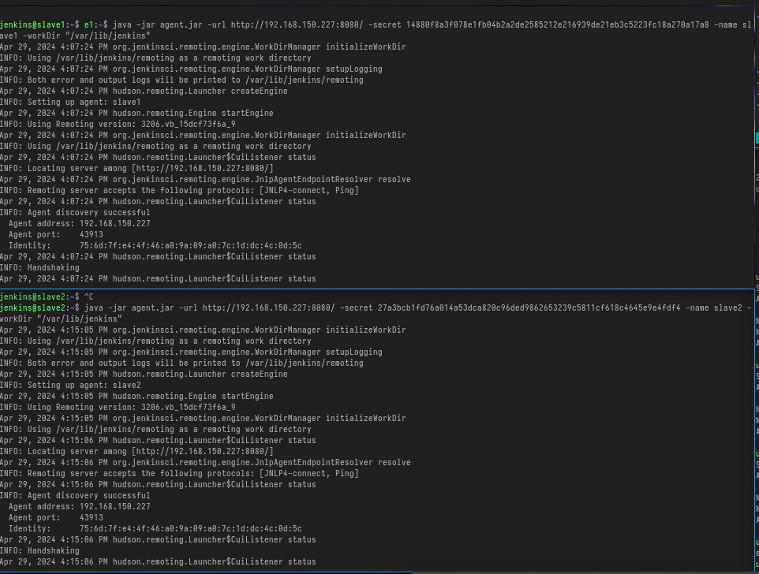

-   [Reto 2](#reto-2)
    -   [Distribución de
        agentes](#distribución-de-agentes)
    -   [¿Porqué separar los en varios
        agentes?](#porqué-separar-los-en-varios-agentes)
    -   [Pruebas de conexión a los agentes y
        stash/unstash](#pruebas-de-conexión-a-los-agentes-y-stashunstash)
    -   [Limpieza de
        workspace](#limpieza-de-workspace)

# Reto 2

## Distribución de agentes

Para este apartado utilizaremos la infraestructura definida en el Reto 1

-   Contenedor docker de jenkins en el nodo kvm 192.168.150.227
-   Esclavos en los nodos kvm
    -   slave1: 192.168.150.205
    -   slave2: 192.168.150.229

En la siguiente imagen se muestran los nodos activos\


Habilitamos la comunicación de los agentes\




En este punto tenemos 2 agentes conectados a Jenkins

Probamos la conexión via SSH con el mismo resultado\


## ¿Porqué separar los en varios agentes?

La separación de la ejecución en varios agentes es interesante ya que:
\* Permite realizar escalado tanto estático como dinámico de la carga.
\* Libera al nodo central de las tareas de ejecución. \* Permite la
ejecución en función de deterinadas características, por ejemplo la
necesidas de usar una determinada arquitectura, o sistema operativo. \*
Permite emular arquitecturas distribuidas.

## Pruebas de conexión a los agentes y stash/unstash

Para realizar de ejecución de las distintas fases de la pipeline en
varios agentes además del uso de la funcionalidad stash/unstash
utilizaremos el siguiente etiquetado para los nodos esclavo .

  Nodo     Etiqueta
  -------- ----------
  slave1   agent1
  slave2   agent2

En nuestra pipeline utilizaremos el nodo agent2 para descargar el codigo
y el agent1 para las fases de test ya que hemos configurado este último
con más capacidad de ejecución.

``` groovy
stage('get code from repo') {
     agent { label 'agent2' }
     steps {
       pipelineBanner()
       sh ('''
           [ -e "$WORKSPACE/actividad1-A" ] && rm -fr "$WORKSPACE/actividad1-A"
           git clone https://${GIT_TOKEN}@github.com/dargamenteria/actividad1-A
           ls -arlt 
           echo $WORKSPACE
           '''
          )
         stash  (name: 'workspace')

     }
   }
```

``` groovy
stage('Test phase') {
     parallel {
       stage ('Test phase') {
         agent { label 'agent1' }
         steps {
           pipelineBanner()
           unstash 'workspace'
           sh ('''
               echo "Test phase" 
               cd "$WORKSPACE/actividad1-A"
               export PYTHONPATH=.
               pytest-3 --junitxml=result-test.xml $(pwd)/test/unit
           ''')
         }
       }

       stage ('Test Rest phase') {
         agent { label 'agent1' }
         steps {
           pipelineBanner()
           unstash 'workspace'
           sh ('''
               echo "Test phase" 
               cd "$WORKSPACE/actividad1-A"
               export PYTHONPATH=.
               export FLASK_APP=$(pwd)/app/api.py
               flask run &
               java -jar /apps/wiremock/wiremock-standalone-3.5.4.jar --port 9090 --root-dir $(pwd)/test/wiremock &
               sleep 10
               pytest-3 --junitxml=result-rest.xml $(pwd)/test/rest

               ''')
         }
       }
     }
   }
```

En el siguiente log se muestra la ejecución de la pipeline. Nótese el
uso de la función `pipelineBanner()` definida en nuestra librería
`@Library('test-pipeline-library')_` para verificar los datos del nodo
donde se ejecuta la fase y el uso de la funcionalidad stash / unstash.

    tarted by timer
    Obtained Jenkinsfile from git https://github.com/dargamenteria/actividad1-A
    Loading library test-pipeline-library@master
    Attempting to resolve master from remote references...
     > git --version # timeout=10
     > git --version # 'git version 2.34.1'
     > git ls-remote -h -- https://github.com/dargamenteria/actividad1-A # timeout=10
    Found match: refs/heads/master revision c0394727f7e04f2a5eeae91cc72749a6b5d13084
    The recommended git tool is: git
    No credentials specified
     > git rev-parse --resolve-git-dir /var/lib/jenkins/workspace/Jenkins3_1@libs/9db50c116b0d748c9ba2230e8c4c2703093fa8a3daba5a13ae2d39d47d019d32/.git # timeout=10
    Fetching changes from the remote Git repository
     > git config remote.origin.url https://github.com/dargamenteria/actividad1-A # timeout=10
    Fetching without tags
    Fetching upstream changes from https://github.com/dargamenteria/actividad1-A
     > git --version # timeout=10
     > git --version # 'git version 2.34.1'
     > git fetch --no-tags --force --progress -- https://github.com/dargamenteria/actividad1-A +refs/heads/*:refs/remotes/origin/* # timeout=10
    Checking out Revision c0394727f7e04f2a5eeae91cc72749a6b5d13084 (master)
     > git config core.sparsecheckout # timeout=10
     > git checkout -f c0394727f7e04f2a5eeae91cc72749a6b5d13084 # timeout=10
    Commit message: "fix typo"
     > git rev-list --no-walk c0394727f7e04f2a5eeae91cc72749a6b5d13084 # timeout=10
    [Pipeline] Start of Pipeline
    [Pipeline] node
    Running on Jenkins in /var/lib/jenkins/workspace/Jenkins3_1
    [Pipeline] {
    [Pipeline] stage
    [Pipeline] { (Declarative: Checkout SCM)
    [Pipeline] checkout
    The recommended git tool is: git
    No credentials specified
     > git rev-parse --resolve-git-dir /var/lib/jenkins/workspace/Jenkins3_1/.git # timeout=10
    Fetching changes from the remote Git repository
     > git config remote.origin.url https://github.com/dargamenteria/actividad1-A # timeout=10
    Fetching upstream changes from https://github.com/dargamenteria/actividad1-A
     > git --version # timeout=10
     > git --version # 'git version 2.34.1'
     > git fetch --tags --force --progress -- https://github.com/dargamenteria/actividad1-A +refs/heads/*:refs/remotes/origin/* # timeout=10
     > git rev-parse refs/remotes/origin/master^{commit} # timeout=10
    Checking out Revision c0394727f7e04f2a5eeae91cc72749a6b5d13084 (refs/remotes/origin/master)
     > git config core.sparsecheckout # timeout=10
     > git checkout -f c0394727f7e04f2a5eeae91cc72749a6b5d13084 # timeout=10
    Commit message: "fix typo"
    [Pipeline] }
    [Pipeline] // stage
    [Pipeline] withEnv
    [Pipeline] {
    [Pipeline] withCredentials
    Masking supported pattern matches of $GIT_TOKEN
    [Pipeline] {
    [Pipeline] stage
    [Pipeline] { (Pipeline Info)
    [Pipeline] sh
    + echo         pipelineBanner 
            pipelineBanner 
    [Pipeline] script
    [Pipeline] {
    [Pipeline] sh
    + hostname -f
    + echo Hostname: docker.paranoidworld.es
    Hostname: docker.paranoidworld.es
    + uname -a
    + echo Hostinfo: Linux docker.paranoidworld.es 5.15.0-105-generic #115-Ubuntu SMP Mon Apr 15 09:52:04 UTC 2024 x86_64 x86_64 x86_64 GNU/Linux
    Hostinfo: Linux docker.paranoidworld.es 5.15.0-105-generic #115-Ubuntu SMP Mon Apr 15 09:52:04 UTC 2024 x86_64 x86_64 x86_64 GNU/Linux
    [Pipeline] }
    [Pipeline] // script
    [Pipeline] }
    [Pipeline] // stage
    [Pipeline] stage
    [Pipeline] { (get code from repo)
    [Pipeline] node
    Running on slave2_ssh in /var/lib/jenkins/workspace/Jenkins3_1
    [Pipeline] {
    [Pipeline] checkout
    The recommended git tool is: git
    No credentials specified
    Fetching changes from the remote Git repository
    Checking out Revision c0394727f7e04f2a5eeae91cc72749a6b5d13084 (refs/remotes/origin/master)
     > git rev-parse --resolve-git-dir /var/lib/jenkins/workspace/Jenkins3_1/.git # timeout=10
     > git config remote.origin.url https://github.com/dargamenteria/actividad1-A # timeout=10
    Fetching upstream changes from https://github.com/dargamenteria/actividad1-A
     > git --version # timeout=10
     > git --version # 'git version 2.34.1'
     > git fetch --tags --force --progress -- https://github.com/dargamenteria/actividad1-A +refs/heads/*:refs/remotes/origin/* # timeout=10
     > git rev-parse refs/remotes/origin/master^{commit} # timeout=10
     > git config core.sparsecheckout # timeout=10
     > git checkout -f c0394727f7e04f2a5eeae91cc72749a6b5d13084 # timeout=10
    Commit message: "fix typo"
    [Pipeline] withEnv
    [Pipeline] {
    [Pipeline] script
    [Pipeline] {
    [Pipeline] sh
    + hostname -f
    + echo Hostname: slave2.paranoidworld.es
    Hostname: slave2.paranoidworld.es
    + uname -a
    + echo Hostinfo: Linux slave2.paranoidworld.es 5.15.0-105-generic #115-Ubuntu SMP Mon Apr 15 09:52:04 UTC 2024 x86_64 x86_64 x86_64 GNU/Linux
    Hostinfo: Linux slave2.paranoidworld.es 5.15.0-105-generic #115-Ubuntu SMP Mon Apr 15 09:52:04 UTC 2024 x86_64 x86_64 x86_64 GNU/Linux
    [Pipeline] }
    [Pipeline] // script
    [Pipeline] sh
    + [ -e /var/lib/jenkins/workspace/Jenkins3_1/actividad1-A ]
    + rm -fr /var/lib/jenkins/workspace/Jenkins3_1/actividad1-A
    + git clone https://****@github.com/dargamenteria/actividad1-A
    Cloning into 'actividad1-A'...
    + ls -arlt
    total 100
    -rw-rw-r-- 1 jenkins jenkins   413 May  1 19:14 README.md
    -rw-rw-r-- 1 jenkins jenkins 38600 May  1 19:14 Parte A Reto1.md
    -rw-rw-r-- 1 jenkins jenkins  2235 May  1 19:14 Jenkinsfile
    -rw-rw-r-- 1 jenkins jenkins  1403 May  1 19:14 JENKINSFILE
    -rw-rw-r-- 1 jenkins jenkins    52 May  1 19:14 .gitignore
    drwxrwxr-x 2 jenkins jenkins  4096 May  1 19:14 app
    drwxrwxr-x 2 jenkins jenkins  4096 May  1 19:14 _resources
    drwxrwxr-x 3 jenkins jenkins  4096 May  1 19:14 test-pipeline-library
    drwxrwxr-x 6 jenkins jenkins  4096 May  1 19:14 test
    -rw-rw-r-- 1 jenkins jenkins   169 May  1 19:14 pytest.ini
    -rw-rw-r-- 1 jenkins jenkins   347 May  1 19:14 md.sh
    drwxrwxr-x 4 jenkins jenkins  4096 May  1 19:14 iac
    drwxrwxr-x 4 jenkins jenkins  4096 May  1 19:14 ..
    drwxrwxr-x 8 jenkins jenkins  4096 May  1 19:15 .git
    drwxrwxr-x 9 jenkins jenkins  4096 May  1 19:15 .
    drwxrwxr-x 8 jenkins jenkins  4096 May  1 19:15 actividad1-A
    + echo /var/lib/jenkins/workspace/Jenkins3_1
    /var/lib/jenkins/workspace/Jenkins3_1
    [Pipeline] stash
    Stashed 134 file(s)
    [Pipeline] }
    [Pipeline] // withEnv
    [Pipeline] }
    [Pipeline] // node
    [Pipeline] }
    [Pipeline] // stage
    [Pipeline] stage
    [Pipeline] { (Test phase)
    [Pipeline] parallel
    [Pipeline] { (Branch: Test phase)
    [Pipeline] { (Branch: Test Rest phase)
    [Pipeline] stage
    [Pipeline] { (Test phase)
    [Pipeline] stage
    [Pipeline] { (Test Rest phase)
    [Pipeline] node
    [Pipeline] node
    Still waiting to schedule task
    Waiting for next available executor on ‘slave1_ssh’
    Still waiting to schedule task
    Waiting for next available executor on ‘slave1_ssh’
    Running on slave1_ssh in /var/lib/jenkins/workspace/Jenkins3_1
    [Pipeline] {
    [Pipeline] checkout
    The recommended git tool is: git
    No credentials specified
    Fetching changes from the remote Git repository
    Checking out Revision c0394727f7e04f2a5eeae91cc72749a6b5d13084 (refs/remotes/origin/master)
     > git rev-parse --resolve-git-dir /var/lib/jenkins/workspace/Jenkins3_1/.git # timeout=10
     > git config remote.origin.url https://github.com/dargamenteria/actividad1-A # timeout=10
    Fetching upstream changes from https://github.com/dargamenteria/actividad1-A
     > git --version # timeout=10
     > git --version # 'git version 2.34.1'
     > git fetch --tags --force --progress -- https://github.com/dargamenteria/actividad1-A +refs/heads/*:refs/remotes/origin/* # timeout=10
     > git rev-parse refs/remotes/origin/master^{commit} # timeout=10
     > git config core.sparsecheckout # timeout=10
     > git checkout -f c0394727f7e04f2a5eeae91cc72749a6b5d13084 # timeout=10
    Commit message: "fix typo"
    [Pipeline] withEnv
    [Pipeline] {
    [Pipeline] script
    [Pipeline] {
    [Pipeline] sh
    + hostname -f
    + echo Hostname: slave1.paranoidworld.es
    Hostname: slave1.paranoidworld.es
    + uname -a
    + echo Hostinfo: Linux slave1.paranoidworld.es 5.15.0-105-generic #115-Ubuntu SMP Mon Apr 15 09:52:04 UTC 2024 x86_64 x86_64 x86_64 GNU/Linux
    Hostinfo: Linux slave1.paranoidworld.es 5.15.0-105-generic #115-Ubuntu SMP Mon Apr 15 09:52:04 UTC 2024 x86_64 x86_64 x86_64 GNU/Linux
    [Pipeline] }
    [Pipeline] // script
    [Pipeline] unstash
    [Pipeline] sh
    + echo Test phase
    Test phase
    + cd /var/lib/jenkins/workspace/Jenkins3_1/actividad1-A
    + export PYTHONPATH=.
    + pwd
    + pytest-3 --junitxml=result-test.xml /var/lib/jenkins/workspace/Jenkins3_1/actividad1-A/test/unit
    ============================= test session starts ==============================
    platform linux -- Python 3.10.12, pytest-6.2.5, py-1.10.0, pluggy-0.13.0
    rootdir: /var/lib/jenkins/workspace/Jenkins3_1/actividad1-A, configfile: pytest.ini
    collected 11 items

    test/unit/calc_test.py .........                                         [ 81%]
    test/unit/util_test.py ..                                                [100%]

    - generated xml file: /var/lib/jenkins/workspace/Jenkins3_1/actividad1-A/result-test.xml -
    ============================== 11 passed in 0.06s ==============================
    [Pipeline] }
    [Pipeline] // withEnv
    [Pipeline] }
    Running on slave1_ssh in /var/lib/jenkins/workspace/Jenkins3_1
    [Pipeline] // node
    [Pipeline] }
    [Pipeline] {
    [Pipeline] // stage
    [Pipeline] }
    [Pipeline] checkout
    The recommended git tool is: git
    No credentials specified
    Fetching changes from the remote Git repository
    Checking out Revision c0394727f7e04f2a5eeae91cc72749a6b5d13084 (refs/remotes/origin/master)
    Commit message: "fix typo"
     > git rev-parse --resolve-git-dir /var/lib/jenkins/workspace/Jenkins3_1/.git # timeout=10
     > git config remote.origin.url https://github.com/dargamenteria/actividad1-A # timeout=10
    Fetching upstream changes from https://github.com/dargamenteria/actividad1-A
     > git --version # timeout=10
     > git --version # 'git version 2.34.1'
     > git fetch --tags --force --progress -- https://github.com/dargamenteria/actividad1-A +refs/heads/*:refs/remotes/origin/* # timeout=10
     > git rev-parse refs/remotes/origin/master^{commit} # timeout=10
     > git config core.sparsecheckout # timeout=10
     > git checkout -f c0394727f7e04f2a5eeae91cc72749a6b5d13084 # timeout=10
    [Pipeline] withEnv
    [Pipeline] {
    [Pipeline] script
    [Pipeline] {
    [Pipeline] sh
    + hostname -f
    + echo Hostname: slave1.paranoidworld.es
    Hostname: slave1.paranoidworld.es
    + uname -a
    + echo Hostinfo: Linux slave1.paranoidworld.es 5.15.0-105-generic #115-Ubuntu SMP Mon Apr 15 09:52:04 UTC 2024 x86_64 x86_64 x86_64 GNU/Linux
    Hostinfo: Linux slave1.paranoidworld.es 5.15.0-105-generic #115-Ubuntu SMP Mon Apr 15 09:52:04 UTC 2024 x86_64 x86_64 x86_64 GNU/Linux
    [Pipeline] }
    [Pipeline] // script
    [Pipeline] unstash
    [Pipeline] sh
    + echo Test phase
    Test phase
    + cd /var/lib/jenkins/workspace/Jenkins3_1/actividad1-A
    + export PYTHONPATH=.
    + pwd
    + export FLASK_APP=/var/lib/jenkins/workspace/Jenkins3_1/actividad1-A/app/api.py
    + sleep 10
    + flask run
    + pwd
    + java -jar /apps/wiremock/wiremock-standalone-3.5.4.jar --port 9090 --root-dir /var/lib/jenkins/workspace/Jenkins3_1/actividad1-A/test/wiremock
     * Serving Flask app '/var/lib/jenkins/workspace/Jenkins3_1/actividad1-A/app/api.py' (lazy loading)
     * Environment: production
       WARNING: This is a development server. Do not use it in a production deployment.
       Use a production WSGI server instead.
     * Debug mode: off
     * Running on http://127.0.0.1:5000/ (Press CTRL+C to quit)

    ██     ██ ██ ██████  ███████ ███    ███  ██████   ██████ ██   ██ 
    ██     ██ ██ ██   ██ ██      ████  ████ ██    ██ ██      ██  ██  
    ██  █  ██ ██ ██████  █████   ██ ████ ██ ██    ██ ██      █████   
    ██ ███ ██ ██ ██   ██ ██      ██  ██  ██ ██    ██ ██      ██  ██  
     ███ ███  ██ ██   ██ ███████ ██      ██  ██████   ██████ ██   ██ 

    ----------------------------------------------------------------
    |               Cloud: https://wiremock.io/cloud               |
    |                                                              |
    |               Slack: https://slack.wiremock.org              |
    ----------------------------------------------------------------

    version:                      3.5.4
    port:                         9090
    enable-browser-proxying:      false
    disable-banner:               false
    no-request-journal:           false
    verbose:                      false

    extensions:                   response-template,webhook
    + pwd
    + pytest-3 --junitxml=result-rest.xml /var/lib/jenkins/workspace/Jenkins3_1/actividad1-A/test/rest
    ============================= test session starts ==============================
    platform linux -- Python 3.10.12, pytest-6.2.5, py-1.10.0, pluggy-0.13.0
    rootdir: /var/lib/jenkins/workspace/Jenkins3_1/actividad1-A, configfile: pytest.ini
    collected 2 items

    test/rest/api_test.py 127.0.0.1 - - [01/May/2024 19:18:02] "GET /calc/add/1/2 HTTP/1.1" 200 -
    ..                                                 [100%]

    - generated xml file: /var/lib/jenkins/workspace/Jenkins3_1/actividad1-A/result-rest.xml -
    ============================== 2 passed in 0.50s ===============================
    [Pipeline] }
    [Pipeline] // withEnv
    [Pipeline] }
    [Pipeline] // node
    [Pipeline] }
    [Pipeline] // stage
    [Pipeline] }
    [Pipeline] // parallel
    [Pipeline] }
    [Pipeline] // stage
    [Pipeline] stage
    [Pipeline] { (Result Test)
    [Pipeline] node
    Running on slave1_ssh in /var/lib/jenkins/workspace/Jenkins3_1
    [Pipeline] {
    [Pipeline] checkout
    The recommended git tool is: git
    No credentials specified
    Fetching changes from the remote Git repository
    Checking out Revision c0394727f7e04f2a5eeae91cc72749a6b5d13084 (refs/remotes/origin/master)
     > git rev-parse --resolve-git-dir /var/lib/jenkins/workspace/Jenkins3_1/.git # timeout=10
     > git config remote.origin.url https://github.com/dargamenteria/actividad1-A # timeout=10
    Fetching upstream changes from https://github.com/dargamenteria/actividad1-A
     > git --version # timeout=10
     > git --version # 'git version 2.34.1'
     > git fetch --tags --force --progress -- https://github.com/dargamenteria/actividad1-A +refs/heads/*:refs/remotes/origin/* # timeout=10
     > git rev-parse refs/remotes/origin/master^{commit} # timeout=10
     > git config core.sparsecheckout # timeout=10
     > git checkout -f c0394727f7e04f2a5eeae91cc72749a6b5d13084 # timeout=10
    Commit message: "fix typo"
    [Pipeline] withEnv
    [Pipeline] {
    [Pipeline] script
    [Pipeline] {
    [Pipeline] sh
    + hostname -f
    + echo Hostname: slave1.paranoidworld.es
    Hostname: slave1.paranoidworld.es
    + uname -a
    + echo Hostinfo: Linux slave1.paranoidworld.es 5.15.0-105-generic #115-Ubuntu SMP Mon Apr 15 09:52:04 UTC 2024 x86_64 x86_64 x86_64 GNU/Linux
    Hostinfo: Linux slave1.paranoidworld.es 5.15.0-105-generic #115-Ubuntu SMP Mon Apr 15 09:52:04 UTC 2024 x86_64 x86_64 x86_64 GNU/Linux
    [Pipeline] }
    [Pipeline] // script
    [Pipeline] catchError
    [Pipeline] {
    [Pipeline] unstash
    [Pipeline] sh
    + pwd
    + echo /var/lib/jenkins/workspace/Jenkins3_1
    /var/lib/jenkins/workspace/Jenkins3_1
    + sleep 10
    + pwd
    + ls -arlt /var/lib/jenkins/workspace/Jenkins3_1/actividad1-A/result-*.xml
    ls: cannot access '/var/lib/jenkins/workspace/Jenkins3_1/actividad1-A/result-*.xml': No such file or directory
    [Pipeline] }
    ERROR: script returned exit code 2
    [Pipeline] // catchError
    [Pipeline] }
    [Pipeline] // withEnv
    [Pipeline] }
    [Pipeline] // node
    [Pipeline] }
    [Pipeline] // stage
    [Pipeline] }
    [Pipeline] // withCredentials
    [Pipeline] }
    [Pipeline] // withEnv
    [Pipeline] }
    [Pipeline] // node
    [Pipeline] End of Pipeline
    Finished: SUCCESS

## Limpieza de workspace

Hemos encontrado un plugin que en teoría puede servirnos para realizar
la limpieza del workspace\
[Workspace Clean](https://plugins.jenkins.io/ws-cleanup/) y [Dsitributed
Workspace Clean up](https://plugins.jenkins.io/hudson-wsclean-plugin/) .
Cierto es que ninguno no está actualmente mantenido.

La configuración del DWC se realiza desde la configuración general de
Jenkins\


La ejecución del plugin WC se realiza dentro un bloque post global


Adicionalmente, también se puede ajustar el histórico de construcciones


