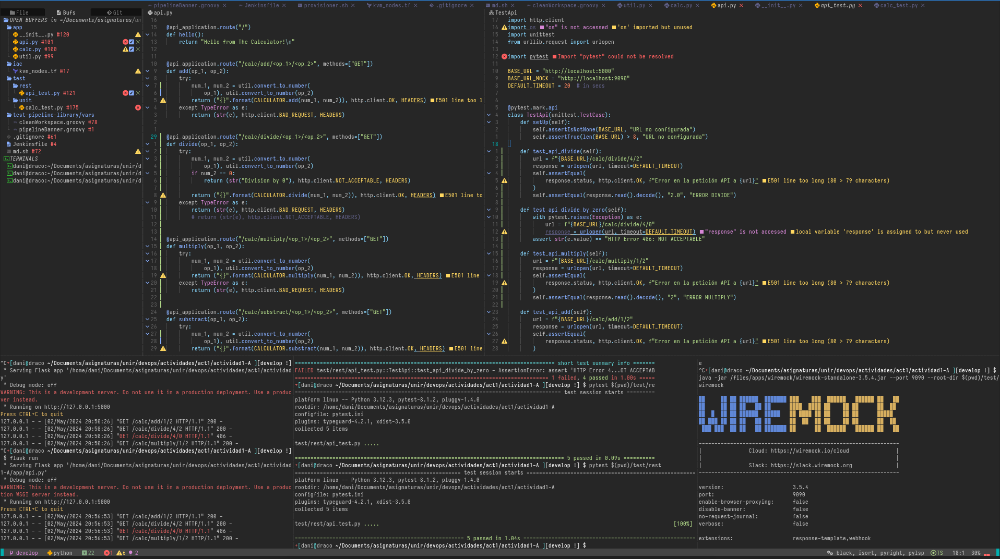

-   [Reto 3](#reto-3)
    -   [Generar una rama nueva "develop" a partir de la rama
        master](#generar-una-rama-nueva-develop-a-partir-de-la-rama-master)
        -   [Servios multiply y
            divide](#servios-multiply-y-divide)
        -   [Añadir los test de
            integración](#añadir-los-test-de-integración)

# Reto 3

## Generar una rama nueva "develop" a partir de la rama master

Se crea una nueva rama develop a partir de la rama master. En esta rama
se van a realizar los cambios en el codigo \* Generar microservicios
multitpy y dive \* Añadir los test de integración

### Servios multiply y divide

Este es el codigo correspondiente a los microservicios pedidos

``` python
@api_application.route("/calc/divide/<op_1>/<op_2>", methods=["GET"])
def divide(op_1, op_2):
    try:
        num_1, num_2 = util.convert_to_number(
            op_1), util.convert_to_number(op_2)
        if num_2 == 0:
            return (str("Division by 0"), http.client.NOT_ACCEPTABLE, HEADERS)

        return ("{}".format(CALCULATOR.divide(num_1, num_2)), http.client.OK, HEADERS)
    except TypeError as e:
        return (str(e), http.client.BAD_REQUEST, HEADERS)

@api_application.route("/calc/multiply/<op_1>/<op_2>", methods=["GET"])
def multiply(op_1, op_2):
    try:
        num_1, num_2 = util.convert_to_number(
            op_1), util.convert_to_number(op_2)
        return ("{}".format(CALCULATOR.multiply(num_1, num_2)), http.client.OK, HEADERS)
    except TypeError as e:
        return (str(e), http.client.BAD_REQUEST, HEADERS)
```

### Añadir los test de integración

Este codigo corresponde con los test de los microservicios

``` python
def test_api_divide(self):
       url = f"{BASE_URL}/calc/divide/4/2"
       response = urlopen(url, timeout=DEFAULT_TIMEOUT)
       self.assertEqual(
           response.status, http.client.OK, f"Error en la petición API a {url}"
       )
       self.assertEqual(response.read().decode(), "2.0", "ERROR DIVIDE")

   def test_api_divide_by_zero(self):
       with pytest.raises(Exception) as e:
           url = f"{BASE_URL}/calc/divide/4/0"
           response = urlopen(url, timeout=DEFAULT_TIMEOUT)
       assert str(e.value) == "HTTP Error 406: NOT ACCEPTABLE"

   def test_api_multiply(self):
       url = f"{BASE_URL}/calc/multiply/1/2"
       response = urlopen(url, timeout=DEFAULT_TIMEOUT)
       self.assertEqual(
           response.status, http.client.OK, f"Error en la petición API a {url}"
       )
       self.assertEqual(response.read().decode(), "2", "ERROR MULTIPLY")
```

La siguiente imagen muestra claramente los resultados de la ejecución de
los test en local


Abajo se muestra la salida de la ejecución de la nueva pipeline.
Mayormente el unico cambio importante ha sido realizar la operación de
commit en la rama adecuada

``` groovy
stage('Build phase') {
      agent { label 'agent2' }
      steps {
        pipelineBanner()
          sh ('''
              [ -e "$WORKSPACE/actividad1-A" ] && rm -fr "$WORKSPACE/actividad1-A"
              ls -arlt 
              echo $WORKSPACE
              '''
             )
          git branch: 'develop', url: 'https://github.com/dargamenteria/actividad1-A'
          stash  (name: 'workspace')

      }
    }
```

``` bash
Started by user admin
Obtained Jenkinsfile from git https://github.com/dargamenteria/actividad1-A
Loading library test-pipeline-library@master
Attempting to resolve master from remote references...
 > git --version # timeout=10
 > git --version # 'git version 2.34.1'
 > git ls-remote -h -- https://github.com/dargamenteria/actividad1-A # timeout=10
Found match: refs/heads/master revision c60b9ff762e4de13abfc3081417b03146c6fd630
The recommended git tool is: git
No credentials specified
 > git rev-parse --resolve-git-dir /var/lib/jenkins/workspace/Jenkins3_3@libs/9db50c116b0d748c9ba2230e8c4c2703093fa8a3daba5a13ae2d39d47d019d32/.git # timeout=10
Fetching changes from the remote Git repository
 > git config remote.origin.url https://github.com/dargamenteria/actividad1-A # timeout=10
Fetching without tags
Fetching upstream changes from https://github.com/dargamenteria/actividad1-A
 > git --version # timeout=10
 > git --version # 'git version 2.34.1'
 > git fetch --no-tags --force --progress -- https://github.com/dargamenteria/actividad1-A +refs/heads/*:refs/remotes/origin/* # timeout=10
Checking out Revision c60b9ff762e4de13abfc3081417b03146c6fd630 (master)
 > git config core.sparsecheckout # timeout=10
 > git checkout -f c60b9ff762e4de13abfc3081417b03146c6fd630 # timeout=10
Commit message: "Added clean workspace function"
 > git rev-list --no-walk e9c505717abfee45b8cca197dd8e04bbddb5795f # timeout=10
[Pipeline] Start of Pipeline
[Pipeline] node
Running on slave2_ssh in /var/lib/jenkins/workspace/Jenkins3_3
[Pipeline] {
[Pipeline] stage
[Pipeline] { (Declarative: Checkout SCM)
[Pipeline] checkout
The recommended git tool is: git
No credentials specified
Cloning the remote Git repository
Cloning repository https://github.com/dargamenteria/actividad1-A
 > git init /var/lib/jenkins/workspace/Jenkins3_3 # timeout=10
Fetching upstream changes from https://github.com/dargamenteria/actividad1-A
 > git --version # timeout=10
 > git --version # 'git version 2.34.1'
 > git fetch --tags --force --progress -- https://github.com/dargamenteria/actividad1-A +refs/heads/*:refs/remotes/origin/* # timeout=10
Avoid second fetch
Checking out Revision 897db06fe2b68a053ed911c0d0673e1139397adb (refs/remotes/origin/develop)
 > git config remote.origin.url https://github.com/dargamenteria/actividad1-A # timeout=10
 > git config --add remote.origin.fetch +refs/heads/*:refs/remotes/origin/* # timeout=10
 > git rev-parse refs/remotes/origin/develop^{commit} # timeout=10
 > git config core.sparsecheckout # timeout=10
 > git checkout -f 897db06fe2b68a053ed911c0d0673e1139397adb # timeout=10
Commit message: "Update Jenkins file"
 > git rev-list --no-walk e9c505717abfee45b8cca197dd8e04bbddb5795f # timeout=10
[Pipeline] }
[Pipeline] // stage
[Pipeline] withEnv
[Pipeline] {
[Pipeline] withCredentials
Masking supported pattern matches of $GIT_TOKEN
[Pipeline] {
[Pipeline] stage
[Pipeline] { (Pipeline Info)
[Pipeline] sh
+ echo         pipelineBanner 
        pipelineBanner 
[Pipeline] script
[Pipeline] {
[Pipeline] sh
+ hostname -f
+ echo Hostname: slave2.paranoidworld.es
Hostname: slave2.paranoidworld.es
+ uname -a
+ echo Hostinfo: Linux slave2.paranoidworld.es 5.15.0-105-generic #115-Ubuntu SMP Mon Apr 15 09:52:04 UTC 2024 x86_64 x86_64 x86_64 GNU/Linux
Hostinfo: Linux slave2.paranoidworld.es 5.15.0-105-generic #115-Ubuntu SMP Mon Apr 15 09:52:04 UTC 2024 x86_64 x86_64 x86_64 GNU/Linux
[Pipeline] }
[Pipeline] // script
[Pipeline] }
[Pipeline] // stage
[Pipeline] stage
[Pipeline] { (Build phase)
[Pipeline] node
Running on slave2_ssh in /var/lib/jenkins/workspace/Jenkins3_3@2
[Pipeline] {
[Pipeline] checkout
The recommended git tool is: git
No credentials specified
Fetching changes from the remote Git repository
Checking out Revision 897db06fe2b68a053ed911c0d0673e1139397adb (refs/remotes/origin/develop)
 > git rev-parse --resolve-git-dir /var/lib/jenkins/workspace/Jenkins3_3@2/.git # timeout=10
 > git config remote.origin.url https://github.com/dargamenteria/actividad1-A # timeout=10
Fetching upstream changes from https://github.com/dargamenteria/actividad1-A
 > git --version # timeout=10
 > git --version # 'git version 2.34.1'
 > git fetch --tags --force --progress -- https://github.com/dargamenteria/actividad1-A +refs/heads/*:refs/remotes/origin/* # timeout=10
 > git rev-parse refs/remotes/origin/develop^{commit} # timeout=10
 > git config core.sparsecheckout # timeout=10
 > git checkout -f 897db06fe2b68a053ed911c0d0673e1139397adb # timeout=10
Commit message: "Update Jenkins file"
[Pipeline] withEnv
[Pipeline] {
[Pipeline] script
[Pipeline] {
[Pipeline] sh
+ hostname -f
+ echo Hostname: slave2.paranoidworld.es
Hostname: slave2.paranoidworld.es
+ uname -a
+ echo Hostinfo: Linux slave2.paranoidworld.es 5.15.0-105-generic #115-Ubuntu SMP Mon Apr 15 09:52:04 UTC 2024 x86_64 x86_64 x86_64 GNU/Linux
Hostinfo: Linux slave2.paranoidworld.es 5.15.0-105-generic #115-Ubuntu SMP Mon Apr 15 09:52:04 UTC 2024 x86_64 x86_64 x86_64 GNU/Linux
[Pipeline] }
[Pipeline] // script
[Pipeline] sh
+ [ -e /var/lib/jenkins/workspace/Jenkins3_3@2/actividad1-A ]
+ rm -fr /var/lib/jenkins/workspace/Jenkins3_3@2/actividad1-A
+ ls -arlt
total 116
-rw-rw-r-- 1 jenkins jenkins    52 May  2 19:39 .gitignore
-rw-rw-r-- 1 jenkins jenkins   413 May  2 19:39 README.md
-rw-rw-r-- 1 jenkins jenkins 20305 May  2 19:39 Parte A Reto2.md
-rw-rw-r-- 1 jenkins jenkins 40133 May  2 19:39 Parte A Reto1.md
-rw-rw-r-- 1 jenkins jenkins  1403 May  2 19:39 JENKINSFILE
drwxrwxr-x 2 jenkins jenkins  4096 May  2 19:39 app
drwxrwxr-x 2 jenkins jenkins  4096 May  2 19:39 _resources
drwxrwxr-x 3 jenkins jenkins  4096 May  2 19:39 test-pipeline-library
drwxrwxr-x 6 jenkins jenkins  4096 May  2 19:39 test
-rw-rw-r-- 1 jenkins jenkins   169 May  2 19:39 pytest.ini
-rw-rw-r-- 1 jenkins jenkins   348 May  2 19:39 md.sh
drwxrwxr-x 4 jenkins jenkins  4096 May  2 19:39 iac
drwxrwxr-x 9 jenkins jenkins  4096 May  2 19:54 ..
-rw-rw-r-- 1 jenkins jenkins  2376 May  2 19:55 Jenkinsfile
drwxrwxr-x 8 jenkins jenkins  4096 May  2 19:55 .git
drwxrwxr-x 8 jenkins jenkins  4096 May  2 19:55 .
+ echo /var/lib/jenkins/workspace/Jenkins3_3@2
/var/lib/jenkins/workspace/Jenkins3_3@2
[Pipeline] git
The recommended git tool is: git
No credentials specified
Fetching changes from the remote Git repository
Checking out Revision 897db06fe2b68a053ed911c0d0673e1139397adb (refs/remotes/origin/develop)
Commit message: "Update Jenkins file"
[Pipeline] stash
 > git rev-parse --resolve-git-dir /var/lib/jenkins/workspace/Jenkins3_3@2/.git # timeout=10
 > git config remote.origin.url https://github.com/dargamenteria/actividad1-A # timeout=10
Fetching upstream changes from https://github.com/dargamenteria/actividad1-A
 > git --version # timeout=10
 > git --version # 'git version 2.34.1'
 > git fetch --tags --force --progress -- https://github.com/dargamenteria/actividad1-A +refs/heads/*:refs/remotes/origin/* # timeout=10
 > git rev-parse refs/remotes/origin/develop^{commit} # timeout=10
 > git config core.sparsecheckout # timeout=10
 > git checkout -f 897db06fe2b68a053ed911c0d0673e1139397adb # timeout=10
 > git branch -a -v --no-abbrev # timeout=10
 > git checkout -b develop 897db06fe2b68a053ed911c0d0673e1139397adb # timeout=10
Stashed 86 file(s)
[Pipeline] }
[Pipeline] // withEnv
[Pipeline] }
[Pipeline] // node
[Pipeline] }
[Pipeline] // stage
[Pipeline] stage
[Pipeline] { (Test phase)
[Pipeline] parallel
[Pipeline] { (Branch: Test phase)
[Pipeline] { (Branch: Test Rest phase)
[Pipeline] stage
[Pipeline] { (Test phase)
[Pipeline] stage
[Pipeline] { (Test Rest phase)
[Pipeline] node
[Pipeline] node
Running on slave1_ssh in /var/lib/jenkins/workspace/Jenkins3_3
Running on slave1_ssh in /var/lib/jenkins/workspace/Jenkins3_3@2
[Pipeline] {
[Pipeline] {
[Pipeline] checkout
The recommended git tool is: git
No credentials specified
Fetching changes from the remote Git repository
[Pipeline] checkout
The recommended git tool is: git
No credentials specified
Fetching changes from the remote Git repository
Checking out Revision 897db06fe2b68a053ed911c0d0673e1139397adb (refs/remotes/origin/develop)
 > git rev-parse --resolve-git-dir /var/lib/jenkins/workspace/Jenkins3_3@2/.git # timeout=10
 > git config remote.origin.url https://github.com/dargamenteria/actividad1-A # timeout=10
Fetching upstream changes from https://github.com/dargamenteria/actividad1-A
 > git --version # timeout=10
 > git --version # 'git version 2.34.1'
 > git fetch --tags --force --progress -- https://github.com/dargamenteria/actividad1-A +refs/heads/*:refs/remotes/origin/* # timeout=10
 > git rev-parse refs/remotes/origin/develop^{commit} # timeout=10
 > git config core.sparsecheckout # timeout=10
 > git checkout -f 897db06fe2b68a053ed911c0d0673e1139397adb # timeout=10
Checking out Revision 897db06fe2b68a053ed911c0d0673e1139397adb (refs/remotes/origin/develop)
 > git rev-parse --resolve-git-dir /var/lib/jenkins/workspace/Jenkins3_3/.git # timeout=10
 > git config remote.origin.url https://github.com/dargamenteria/actividad1-A # timeout=10
Fetching upstream changes from https://github.com/dargamenteria/actividad1-A
 > git --version # timeout=10
 > git --version # 'git version 2.34.1'
 > git fetch --tags --force --progress -- https://github.com/dargamenteria/actividad1-A +refs/heads/*:refs/remotes/origin/* # timeout=10
 > git rev-parse refs/remotes/origin/develop^{commit} # timeout=10
 > git config core.sparsecheckout # timeout=10
 > git checkout -f 897db06fe2b68a053ed911c0d0673e1139397adb # timeout=10
Commit message: "Update Jenkins file"
Commit message: "Update Jenkins file"
[Pipeline] withEnv
[Pipeline] {
[Pipeline] withEnv
[Pipeline] {
[Pipeline] script
[Pipeline] {
[Pipeline] sh
[Pipeline] script
+ hostname -f
+ echo Hostname: slave1.paranoidworld.es
Hostname: slave1.paranoidworld.es
+ uname -a
+ echo Hostinfo: Linux slave1.paranoidworld.es 5.15.0-105-generic #115-Ubuntu SMP Mon Apr 15 09:52:04 UTC 2024 x86_64 x86_64 x86_64 GNU/Linux
Hostinfo: Linux slave1.paranoidworld.es 5.15.0-105-generic #115-Ubuntu SMP Mon Apr 15 09:52:04 UTC 2024 x86_64 x86_64 x86_64 GNU/Linux
[Pipeline] {
[Pipeline] sh
+ hostname -f
+ echo Hostname: slave1.paranoidworld.es
Hostname: slave1.paranoidworld.es
+ uname -a
+ echo Hostinfo: Linux slave1.paranoidworld.es 5.15.0-105-generic #115-Ubuntu SMP Mon Apr 15 09:52:04 UTC 2024 x86_64 x86_64 x86_64 GNU/Linux
Hostinfo: Linux slave1.paranoidworld.es 5.15.0-105-generic #115-Ubuntu SMP Mon Apr 15 09:52:04 UTC 2024 x86_64 x86_64 x86_64 GNU/Linux
[Pipeline] }
[Pipeline] // script
[Pipeline] unstash
[Pipeline] }
[Pipeline] // script
[Pipeline] unstash
[Pipeline] sh
+ echo Test phase
Test phase
+ cd /var/lib/jenkins/workspace/Jenkins3_3@2/actividad1-A
+ export PYTHONPATH=.
+ pwd
+ export FLASK_APP=/var/lib/jenkins/workspace/Jenkins3_3@2/actividad1-A/app/api.py
+ sleep 10
+ flask run
+ pwd
+ java -jar /apps/wiremock/wiremock-standalone-3.5.4.jar --port 9090 --root-dir /var/lib/jenkins/workspace/Jenkins3_3@2/actividad1-A/test/wiremock
 * Serving Flask app '/var/lib/jenkins/workspace/Jenkins3_3@2/actividad1-A/app/api.py' (lazy loading)
 * Environment: production
   WARNING: This is a development server. Do not use it in a production deployment.
   Use a production WSGI server instead.
 * Debug mode: off
 * Running on http://127.0.0.1:5000/ (Press CTRL+C to quit)
[Pipeline] sh
+ echo Test phase
Test phase
+ cd /var/lib/jenkins/workspace/Jenkins3_3/actividad1-A
+ export PYTHONPATH=.
+ pwd
+ pytest-3 --junitxml=result-test.xml /var/lib/jenkins/workspace/Jenkins3_3/actividad1-A/test/unit
============================= test session starts ==============================
platform linux -- Python 3.10.12, pytest-6.2.5, py-1.10.0, pluggy-0.13.0
rootdir: /var/lib/jenkins/workspace/Jenkins3_3/actividad1-A, configfile: pytest.ini
collected 11 items

test/unit/calc_test.py .........                                         [ 81%]
test/unit/util_test.py ..                                                [100%]

- generated xml file: /var/lib/jenkins/workspace/Jenkins3_3/actividad1-A/result-test.xml -
============================== 11 passed in 0.25s ==============================
[Pipeline] }
[Pipeline] // withEnv
[Pipeline] }
[Pipeline] // node
[Pipeline] }
[Pipeline] // stage
[Pipeline] }

██     ██ ██ ██████  ███████ ███    ███  ██████   ██████ ██   ██ 
██     ██ ██ ██   ██ ██      ████  ████ ██    ██ ██      ██  ██  
██  █  ██ ██ ██████  █████   ██ ████ ██ ██    ██ ██      █████   
██ ███ ██ ██ ██   ██ ██      ██  ██  ██ ██    ██ ██      ██  ██  
 ███ ███  ██ ██   ██ ███████ ██      ██  ██████   ██████ ██   ██ 

----------------------------------------------------------------
|               Cloud: https://wiremock.io/cloud               |
|                                                              |
|               Slack: https://slack.wiremock.org              |
----------------------------------------------------------------

version:                      3.5.4
port:                         9090
enable-browser-proxying:      false
disable-banner:               false
no-request-journal:           false
verbose:                      false

extensions:                   response-template,webhook
+ pwd
+ pytest-3 --junitxml=result-rest.xml /var/lib/jenkins/workspace/Jenkins3_3@2/actividad1-A/test/rest
============================= test session starts ==============================
platform linux -- Python 3.10.12, pytest-6.2.5, py-1.10.0, pluggy-0.13.0
rootdir: /var/lib/jenkins/workspace/Jenkins3_3@2/actividad1-A, configfile: pytest.ini
collected 2 items

test/rest/api_test.py 127.0.0.1 - - [02/May/2024 19:55:52] "GET /calc/add/1/2 HTTP/1.1" 200 -
..                                                 [100%]

- generated xml file: /var/lib/jenkins/workspace/Jenkins3_3@2/actividad1-A/result-rest.xml -
============================== 2 passed in 0.49s ===============================
[Pipeline] }
[Pipeline] // withEnv
[Pipeline] }
[Pipeline] // node
[Pipeline] }
[Pipeline] // stage
[Pipeline] }
[Pipeline] // parallel
[Pipeline] }
[Pipeline] // stage
[Pipeline] stage
[Pipeline] { (Result Test)
[Pipeline] node
Running on slave1_ssh in /var/lib/jenkins/workspace/Jenkins3_3
[Pipeline] {
[Pipeline] checkout
The recommended git tool is: git
No credentials specified
Fetching changes from the remote Git repository
Checking out Revision 897db06fe2b68a053ed911c0d0673e1139397adb (refs/remotes/origin/develop)
 > git rev-parse --resolve-git-dir /var/lib/jenkins/workspace/Jenkins3_3/.git # timeout=10
 > git config remote.origin.url https://github.com/dargamenteria/actividad1-A # timeout=10
Fetching upstream changes from https://github.com/dargamenteria/actividad1-A
 > git --version # timeout=10
 > git --version # 'git version 2.34.1'
 > git fetch --tags --force --progress -- https://github.com/dargamenteria/actividad1-A +refs/heads/*:refs/remotes/origin/* # timeout=10
 > git rev-parse refs/remotes/origin/develop^{commit} # timeout=10
 > git config core.sparsecheckout # timeout=10
 > git checkout -f 897db06fe2b68a053ed911c0d0673e1139397adb # timeout=10
Commit message: "Update Jenkins file"
[Pipeline] withEnv
[Pipeline] {
[Pipeline] script
[Pipeline] {
[Pipeline] sh
+ hostname -f
+ echo Hostname: slave1.paranoidworld.es
Hostname: slave1.paranoidworld.es
+ uname -a
+ echo Hostinfo: Linux slave1.paranoidworld.es 5.15.0-105-generic #115-Ubuntu SMP Mon Apr 15 09:52:04 UTC 2024 x86_64 x86_64 x86_64 GNU/Linux
Hostinfo: Linux slave1.paranoidworld.es 5.15.0-105-generic #115-Ubuntu SMP Mon Apr 15 09:52:04 UTC 2024 x86_64 x86_64 x86_64 GNU/Linux
[Pipeline] }
[Pipeline] // script
[Pipeline] catchError
[Pipeline] {
[Pipeline] unstash
[Pipeline] sh
+ pwd
+ echo /var/lib/jenkins/workspace/Jenkins3_3
/var/lib/jenkins/workspace/Jenkins3_3
+ sleep 10
+ pwd
+ ls -arlt /var/lib/jenkins/workspace/Jenkins3_3/actividad1-A/result-*.xml
ls: cannot access '/var/lib/jenkins/workspace/Jenkins3_3/actividad1-A/result-*.xml': No such file or directory
[Pipeline] }
ERROR: script returned exit code 2
[Pipeline] // catchError
[Pipeline] }
[Pipeline] // withEnv
[Pipeline] }
[Pipeline] // node
[Pipeline] }
[Pipeline] // stage
[Pipeline] stage
[Pipeline] { (Declarative: Post Actions)
[Pipeline] cleanWs
[WS-CLEANUP] Deleting project workspace...
[WS-CLEANUP] Deferred wipeout is used...
[WS-CLEANUP] done
[Pipeline] }
[Pipeline] // stage
[Pipeline] }
[Pipeline] // withCredentials
[Pipeline] }
[Pipeline] // withEnv
[Pipeline] }
[Pipeline] // node
[Pipeline] End of Pipeline
Finished: SUCCESS

```
