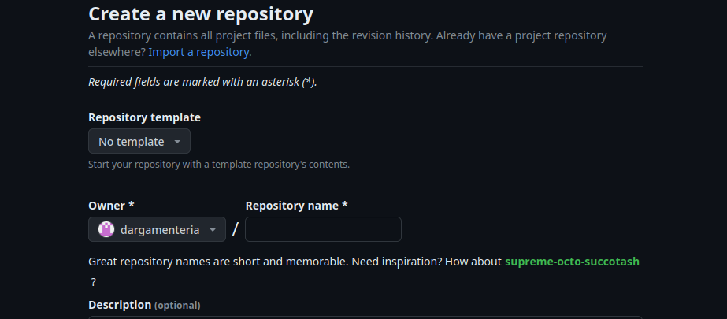
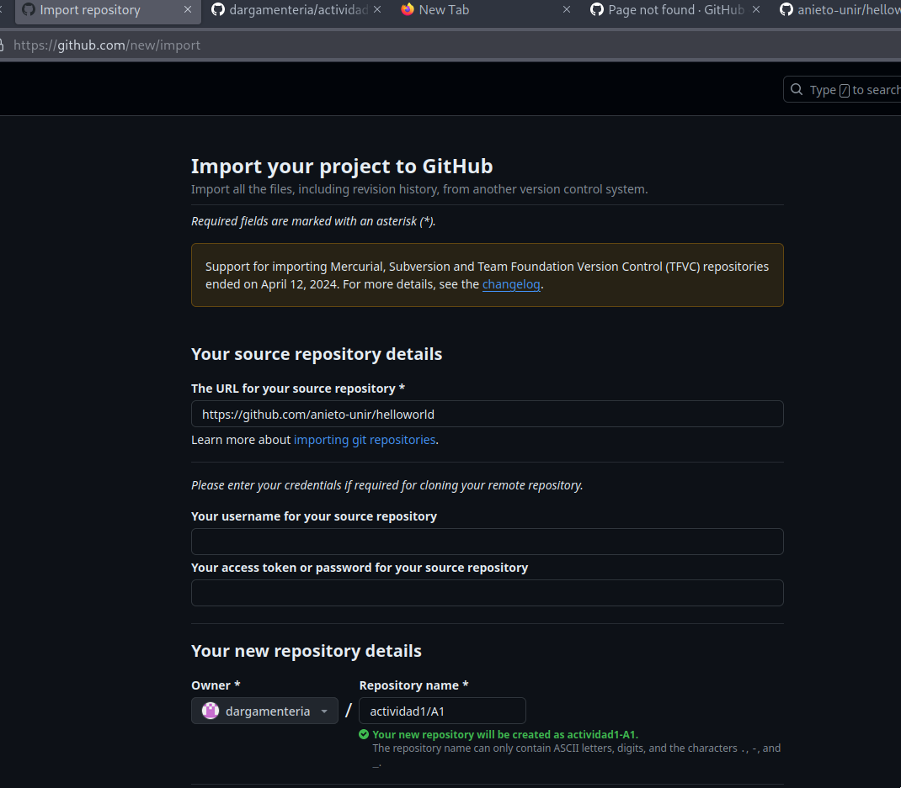
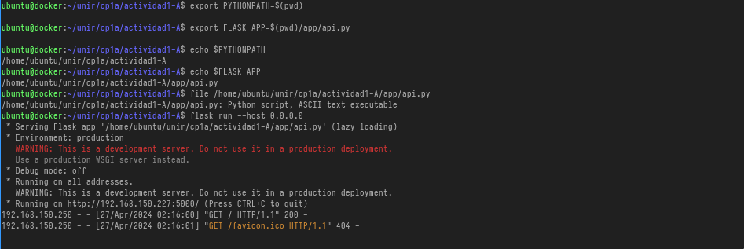

# Clonado del proyecto con Github

Se puede realizar de 2 formas una directamente es desde la propia interfaz de github. Este nos permite clonar un repositorio. Como se muestra en las siguientes imágenes.

  


También se puede realizar via shell

1.  Se clona el repositorio objetivo

```bash
$ git clone https://github.com/anieto-unir/helloworld.git
Cloning into 'helloworld'...
remote: Enumerating objects: 365, done.
remote: Counting objects: 100% (155/155), done.
remote: Compressing objects: 100% (57/57), done.
remote: Total 365 (delta 134), reused 98 (delta 98), pack-reused 210
Receiving objects: 100% (365/365), 82.10 KiB | 1.19 MiB/s, done.
Resolving deltas: 100% (163/163), done
```

2.  Se listan los remote

```bash
$ git remote -v
origin	https://github.com/anieto-unir/helloworld.git (fetch)
origin	https://github.com/anieto-unir/helloworld.git (push)
```

3.  Los eliminamos y añadimos los del repositorio objetivo

```
$ git remote  remove origin
$ git remote -v

```

## Securización local del repositorio git

1.  Para que no ande preguntando por las credenciales usamos [pass](https://www.passwordstore.org/) para almacenarlas utilizando [pass-git-helper](https://github.com/languitar/pass-git-helper) para la integración

```bash
File: /home/dani/.gitconfig
[user]
    name = dargamenteria
    email = dargamenteria@paranoidworld.es
[credential "https://github.com/dargamenteria/"]
  username=dargamenteria@paranoidworld.es
  useHttpPath = true
  helper = pass -p "github/{path}" --template "~/.config/git-credential-pass/github.dargamenteria.template"
```

2.  Añadimos el nuevo origen el token lo sacamos directamente de pass

```bash
$ git remote add origin  https://github.com/dargamenteria/actividad1-A.git
$ git remote -v
origin	https://github.com/dargamenteria/actividad1-A.git (fetch)
origin	https://github.com/dargamenteria/actividad1-A.git (push)

$ pass
Password Store
├── admin
│   └── keepass.gpg
├── github
│   ├── dargamenteria
│   │   └── actividad1-A.git.gpg
│   └── token.gpg

```

3.  Subimos los cambio  
    

```bash
git push origin master
Enumerating objects: 8, done.
Counting objects: 100% (8/8), done.
Delta compression using up to 8 threads
Compressing objects: 100% (7/7), done.
Writing objects: 100% (7/7), 158.96 KiB | 19.87 MiB/s, done.
Total 7 (delta 1), reused 0 (delta 0), pack-reused 0 (from 0)
remote: Resolving deltas: 100% (1/1), completed with 1 local object.
To https://github.com/dargamenteria/actividad1-A.git
   935b003..0a464b8  master -> master
```

4.  En este punto tenemos el repositorio conectado y las credenciales securizadas en un repositorio, local, de claves.

# Pruebas de integración con flask y wiremock

## Unit test con pytest

Primero de todo hacemos las pruebas unitarias con pytest

1.  Cargamos las variables de entorno

```bash
ubuntu@docker:~/unir/cp1a/actividad1-A$ export PYTHONPATH=.
```

2.  Ejecutamos las pruebas unitarias

```bash
ubuntu@docker:~/unir/cp1a/actividad1-A$ pytest-3 $(pwd)/test/unit
===================================================================== test session starts =====================================================================
platform linux -- Python 3.10.12, pytest-6.2.5, py-1.10.0, pluggy-0.13.0
rootdir: /home/ubuntu/unir/cp1a/actividad1-A, configfile: pytest.ini
collected 11 items

test/unit/calc_test.py .........                                                                                                                        [ 81%]
test/unit/util_test.py ..                                                                                                                               [100%]

===================================================================== 11 passed in 0.03s ======================================================================
```

3.Forzamos un error para verificar el correcto funcionamiento de las pruebas

```python
ubuntu@docker:~/unir/cp1a/actividad1-A$ grep -C3 5 test/unit/calc_test.py
        self.calc = Calculator()

    def test_add_method_returns_correct_result(self):
        self.assertEqual(5, self.calc.add(2, 2))
        self.assertEqual(0, self.calc.add(2, -2))
        self.assertEqual(0, self.calc.add(-2, 2))
        self.assertEqual(1, self.calc.add(1, 0))
--

    def test_divide_method_returns_correct_result(self):
        self.assertEqual(1, self.calc.divide(2, 2))
        self.assertEqual(1.5, self.calc.divide(3, 2))
        self.assertRaises(TypeError, self.calc.divide, "2", 2)

    def test_add_method_fails_with_nan_parameter(self):
--

    def test_substract_method_returns_correct_result(self):
        self.assertEqual(4, self.calc.substract(10, 6))
        self.assertEqual(-2, self.calc.substract(256, 258))
        self.assertEqual(-1, self.calc.substract(-1, 0))
        self.assertEqual(0, self.calc.substract(0, 0))
        self.assertEqual(0, self.calc.substract(0, 0))
ubuntu@docker:~/unir/cp1a/actividad1-A$ pytest-3 $(pwd)/test/unit
===================================================================== test session starts =====================================================================
platform linux -- Python 3.10.12, pytest-6.2.5, py-1.10.0, pluggy-0.13.0
rootdir: /home/ubuntu/unir/cp1a/actividad1-A, configfile: pytest.ini
collected 11 items

test/unit/calc_test.py .F.......                                                                                                                        [ 81%]
test/unit/util_test.py ..                                                                                                                               [100%]

========================================================================== FAILURES ===========================================================================
____________________________________________________ TestCalculate.test_add_method_returns_correct_result _____________________________________________________

self = <unit.calc_test.TestCalculate testMethod=test_add_method_returns_correct_result>

    def test_add_method_returns_correct_result(self):
>       self.assertEqual(5, self.calc.add(2, 2))
E       AssertionError: 5 != 4

test/unit/calc_test.py:13: AssertionError
=================================================================== short test summary info ===================================================================
FAILED test/unit/calc_test.py::TestCalculate::test_add_method_returns_correct_result - AssertionError: 5 != 4
================================================================ 1 failed, 10 passed in 0.10s =================================================================
```

4.  Revertimos el cambio


## Pruebas con flask

1. Cargamos las variables de entorno
```bash
ubuntu@docker:~/unir/cp1a/actividad1-A$ export PYTHONPATH=$(pwd)
ubuntu@docker:~/unir/cp1a/actividad1-A$ export FLASK_APP=$(pwd)/app/api.py
ubuntu@docker:~/unir/cp1a/actividad1-A$ echo $PYTHONPATH
/home/ubuntu/unir/cp1a/actividad1-A
ubuntu@docker:~/unir/cp1a/actividad1-A$ echo $FLASK_APP
/home/ubuntu/unir/cp1a/actividad1-A/app/api.py
```
2. Arrancamos flask. Dado que lo ejecutamos en un servidor remoto hemos de hacer que las pruebas  se lanzen en el interfaz de red correcto
```bash
ubuntu@docker:~/unir/cp1a/actividad1-A$ flask run --host 0.0.0.0
 * Serving Flask app '/home/ubuntu/unir/cp1a/actividad1-A/app/api.py' (lazy loading)
 * Environment: production
   WARNING: This is a development server. Do not use it in a production deployment.
   Use a production WSGI server instead.
 * Debug mode: off
 * Running on all addresses.
   WARNING: This is a development server. Do not use it in a production deployment.
 * Running on http://192.168.150.227:5000/ (Press CTRL+C to quit)
192.168.150.250 - - [27/Apr/2024 02:16:00] "GET / HTTP/1.1" 200 -
192.168.150.250 - - [27/Apr/2024 02:16:01] "GET /favicon.ico HTTP/1.1" 404 -
```
 

