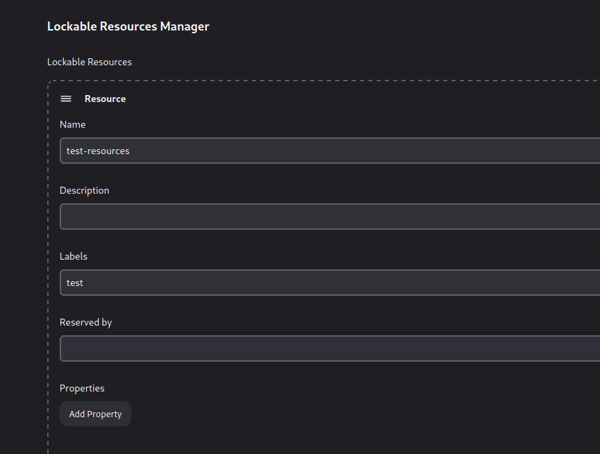

-   [Reto 4](#reto-4)
    -   [Mejoras de la
        fiabilidad](#mejoras-de-la-fiabilidad)

# Reto 4

## Mejoras de la fiabilidad

En en reto 1 durante el lanzamiento de las pruebas de servicio nos
encontramos una cuna condición de carrera.\
Las tareas de arranque de los servidores de flash y wiremock se lanzan
en segundo plano delegando inmediatamente la ejecución de la siguiente
tarea .

Para solucionarlo propusimos dos aleternativas, una espera activa o un
simple sleep arbitrario

-   Espera activa

``` bash
while [ "$(ss -lnt | grep -E "9090|5000" | wc -l)" != "2" ] ; do echo "No perative yet" ; sleep 10; done
```

``` groovy
       stage ('Test Rest phase') {
          agent { label 'agent1' }
          steps {
            pipelineBanner()
              unstash 'workspace'
              sh ('''
                  echo "Test phase" 
                  cd "$WORKSPACE/actividad1-A"
                  export PYTHONPATH=.
                  export FLASK_APP=$(pwd)/app/api.py
                  flask run &
                  java -jar /apps/wiremock/wiremock-standalone-3.5.4.jar --port 9090 --root-dir $(pwd)/test/wiremock &
                  while [ "$(ss -lnt | grep -E "9090|5000" | wc -l)" != "2" ] ; do echo "No perative yet" ; sleep 10; done
                  pytest-3 --junitxml=result-rest.xml $(pwd)/test/rest

                  ''')
          }
        }
```

-   Añadiendo un sleep

``` groovy
stage ('Test Rest phase') {
           steps {
               sh ('''
                   echo "Test phase" 
                   cd "$WORKSPACE/actividad1-A"
                   export PYTHONPATH=.
                   export FLASK_APP=$(pwd)/app/api.py
                   flask run &
                   java -jar /app/wiremock/wiremock-standalone-3.5.4.jar --port 9090 --root-dir $(pwd)/test/wiremock &
                   sleep 10
                   pytest-3 $(pwd)/test/rest
               ''')
           }
       }
```

De cara a problemas de concurrencia y exclusión mutua Jenkins provee de
un plugin que permite su control.\
En este ejemplo usaremos la función lock () para evitar que otros tareas
en otros procesos de construcción interfieran entre si.



``` groovy
stage ('Test Rest phase') {
          agent { label 'agent1' }
          steps {
            pipelineBanner()
            unstash 'workspace'
            lock ('test-resources'){
              sh ('''
                  echo "Test phase" 
                  cd "$WORKSPACE/actividad1-A"
  
                  export PYTHONPATH=.
                  export FLASK_APP=$(pwd)/app/api.py
  
                  flask run &
                  java -jar /apps/wiremock/wiremock-standalone-3.5.4.jar --port 9090 --root-dir $(pwd)/test/wiremock &
  
                  while [ "$(ss -lnt | grep -E "9090|5000" | wc -l)" != "2" ] ; do echo "No perative yet" ; sleep 1; done
  
                  pytest-3 --junitxml=result-rest.xml $(pwd)/test/rest
              ''')
            }
          }
        }
```


``` bash
[Pipeline] lock
Trying to acquire lock on [Resource: test-resources]
Lock acquired on [Resource: test-resources]
[Pipeline] {
[Pipeline] }
[Pipeline] sh
+ echo Test phase
Test phase
+ cd /var/lib/jenkins/workspace/Jenkins4_1@2/actividad1-A
+ export PYTHONPATH=.
+ pwd
+ export FLASK_APP=/var/lib/jenkins/workspace/Jenkins4_1@2/actividad1-A/app/api.py
+ flask run
+ wc -l
+ grep -E 9090|5000
+ pwd
+ ss -lnt
+ java -jar /apps/wiremock/wiremock-standalone-3.5.4.jar --port 9090 --root-dir /var/lib/jenkins/workspace/Jenkins4_1@2/actividad1-A/test/wiremock
+ [ 0 != 2 ]
+ echo No perative yet
No perative yet
+ sleep 1
[Pipeline] // node
[Pipeline] }
[Pipeline] // stage
[Pipeline] }
+ wc -l
+ grep -E 9090|5000
+ ss -lnt
+ [ 0 != 2 ]
+ echo No perative yet
No perative yet
+ sleep 1
 * Serving Flask app '/var/lib/jenkins/workspace/Jenkins4_1@2/actividad1-A/app/api.py' (lazy loading)
 * Environment: production
   WARNING: This is a development server. Do not use it in a production deployment.
   Use a production WSGI server instead.
 * Debug mode: off
 * Running on http://127.0.0.1:5000/ (Press CTRL+C to quit)
+ wc -l
+ grep -E 9090|5000
+ ss -lnt
+ [ 1 != 2 ]
+ echo No perative yet
No perative yet
+ sleep 1
+ wc -l
+ grep -E 9090|5000
+ ss -lnt
+ [ 1 != 2 ]
+ echo No perative yet
No perative yet
+ sleep 1
+ wc -l
+ grep -E 9090|5000
+ ss -lnt
+ [ 1 != 2 ]
+ echo No perative yet
No perative yet
+ sleep 1

██     ██ ██ ██████  ███████ ███    ███  ██████   ██████ ██   ██ 
██     ██ ██ ██   ██ ██      ████  ████ ██    ██ ██      ██  ██  
██  █  ██ ██ ██████  █████   ██ ████ ██ ██    ██ ██      █████   
██ ███ ██ ██ ██   ██ ██      ██  ██  ██ ██    ██ ██      ██  ██  
 ███ ███  ██ ██   ██ ███████ ██      ██  ██████   ██████ ██   ██ 

----------------------------------------------------------------
|               Cloud: https://wiremock.io/cloud               |
|                                                              |
|               Slack: https://slack.wiremock.org              |
----------------------------------------------------------------

version:                      3.5.4
port:                         9090
enable-browser-proxying:      false
disable-banner:               false
no-request-journal:           false
verbose:                      false

extensions:                   response-template,webhook
+ wc -l
+ grep -E 9090|5000
+ ss -lnt
+ [ 2 != 2 ]
+ pwd
+ pytest-3 --junitxml=result-rest.xml /var/lib/jenkins/workspace/Jenkins4_1@2/actividad1-A/test/rest
============================= test session starts ==============================
platform linux -- Python 3.10.12, pytest-6.2.5, py-1.10.0, pluggy-0.13.0
rootdir: /var/lib/jenkins/workspace/Jenkins4_1@2/actividad1-A, configfile: pytest.ini
collected 2 items

test/rest/api_test.py 127.0.0.1 - - [03/May/2024 19:52:42] "GET /calc/add/1/2 HTTP/1.1" 200 -
..                                                 [100%]

- generated xml file: /var/lib/jenkins/workspace/Jenkins4_1@2/actividad1-A/result-rest.xml -
============================== 2 passed in 0.62s ===============================
[Pipeline] }
Lock released on resource [Resource: test-resources]
[Pipeline] // lock
```
